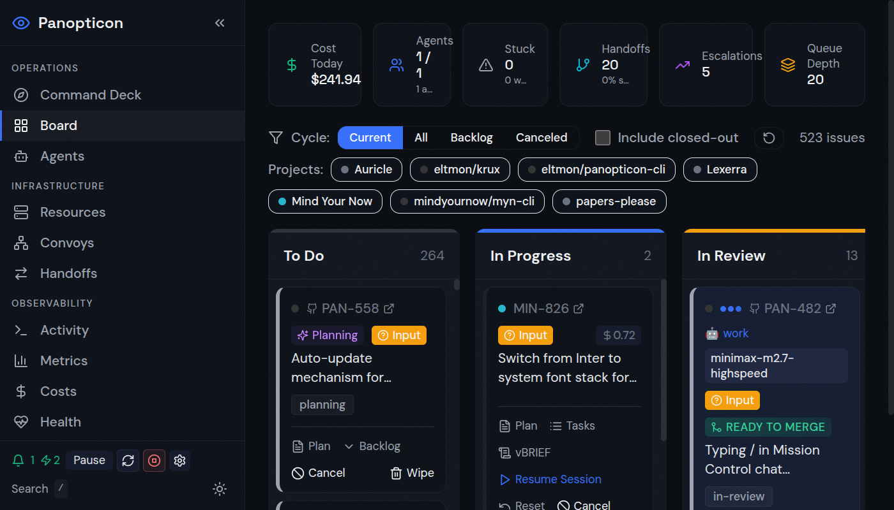
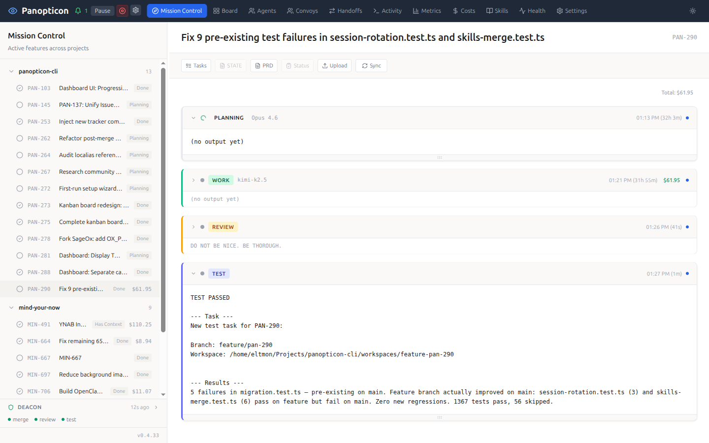
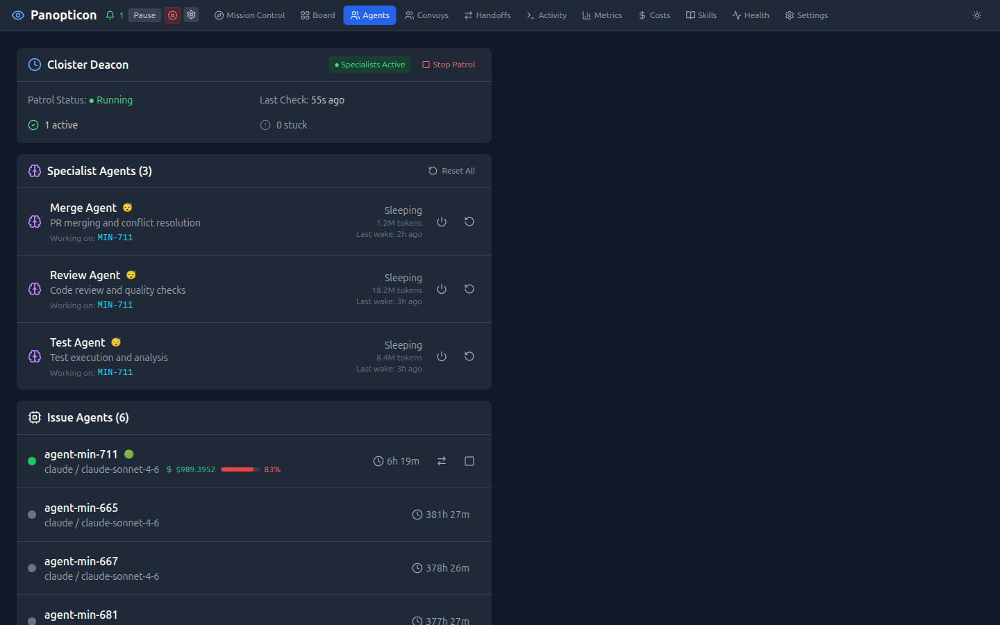
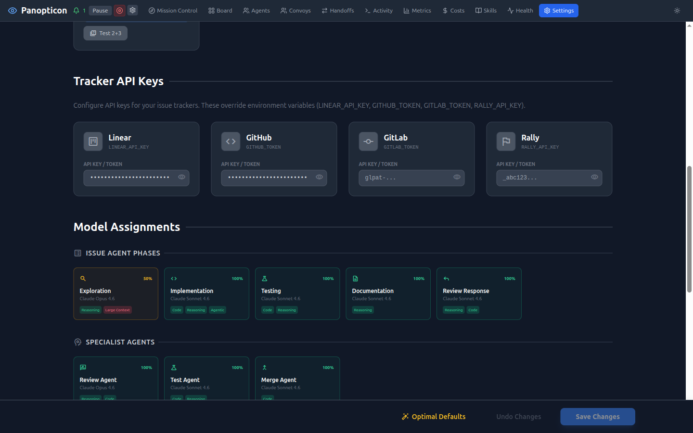

<div align="center">

# Panopticon CLI

**The IDE for the agent era**

[](https://www.npmjs.com/package/@panctl/cli)
[](https://opensource.org/licenses/MIT)
[](https://nodejs.org/)
[](https://github.com/eltmon/panopticon-cli/pulls)

> *"The Panopticon had six sides, one for each of the Founders of Gallifrey..."*
>
> — Classic Doctor Who. The Panopticon was the great hall at the heart of the Time Lord Citadel, where all could be observed. We liked the metaphor.

</div>

IDEs were built for humans who type code. Panopticon is built for humans who **direct** code. Command Deck puts you in the cockpit of a multi-model, multi-agent development environment — you see every change as it happens, steer agents mid-flight, swap models on the fly, diff any turn against main, fork conversations when you want to explore a different approach, and checkpoint work so nothing is lost. When you want to go fully hands-off, the specialist pipeline takes your issue from plan to merged PR without you touching the keyboard.

<div align="center">



</div>

## Quick Start

```bash
npx @panctl/cli
```

No install step required. `npx @panctl/cli` starts Command Deck and opens the dashboard in your browser. Use `panctl` or `pan` after `npm install -g @panctl/cli`. The packaged desktop app is published separately as `@panctl/desktop`.

Dashboard runs at https://pan.localhost (or http://localhost:3011 if you skip HTTPS setup).

See the [full documentation](https://panopticon-cli.com) for detailed setup, configuration, and usage guides.

---

## Command Deck

Command Deck is the live development surface where you and your agents work together. It's built around three zones that update in real time — no refresh buttons, no polling. Every event animates in as it happens.

| Zone | What You See |
|:-----|:-------------|
| **Issue Header** | Issue identity, pipeline stage, live cost tracking, activity sparkline, quality gate rollup |
| **Agent Context** | Selected agent's role, status, current tool, thinking/waiting state, round history, per-session costs |
| **Conversation + Composer** | Full conversation timeline with composer, or a tabbed dashboard when viewing the issue itself |

### What You Can Do

- **Switch models mid-session** — open the model picker and change from Opus to Sonnet to Kimi without restarting
- **Fork conversations** — branch into a summary fork or plain fork, with or without thinking blocks, to explore alternatives
- **Diff any turn** — see exactly what changed file-by-file at any point in the conversation, or compare the full implementation against main
- **Checkpoint and restore** — auto-captured snapshots of agent state let you roll back to any point
- **Plan visually** — vBRIEF plans render as interactive DAGs with item status tracking and acceptance criteria
- **Archive and manage** — archive conversations with inline confirmations, manage session history

### 13 Dashboard Views

Project tree, activity feed, kanban board, agent status, cost analytics, convoy status, specialist handoffs, real-time activity log, performance metrics, skill library, health diagnostics, God View (cross-project), and settings.

---

## Why Panopticon?

- **You set the direction, agents do the typing.** See every change in real time, steer with messages, swap models, fork conversations — you're the conductor, not the audience.
- **Use the right model for the job.** Opus for planning, GPT-5.5 or Kimi for implementation, Haiku for quick commands — automatic routing based on task type, capability, and budget. Override any assignment with two clicks.
- **Work survives across sessions.** PRDs, state files, beads, checkpoints, and skills persist context so agents don't start from zero every time.
- **One skill format, every tool.** Write a SKILL.md once and it works across Claude Code, Codex, Cursor, and Gemini CLI.
- **Go fully hands-off when you want to.** The specialist pipeline takes an issue from plan to merged PR autonomously — review, test, inspect, UAT, merge. You just click Merge when you're satisfied.

---

## How It Works

```
 Issue         PRD           Agent         Review        Test          Merge
┌──────┐    ┌──────┐    ┌──────────┐    ┌──────┐    ┌──────┐    ┌──────────┐
│ Task │ ─► │ Plan │ ─► │ Write    │ ─► │ Code │ ─► │ Run  │ ─► │ PR       │
│ from │    │ with │    │ code in  │    │ rev. │    │ test │    │ merged   │
│ any  │    │ Opus │    │ isolated │    │ by   │    │ by   │    │ by       │
│track-│    │      │    │ worktree │    │ spec-│    │ spec-│    │ spec-    │
│ er   │    │      │    │          │    │ialist│    │ialist│    │ ialist   │
└──────┘    └──────┘    └──────────┘    └──────┘    └──────┘    └──────────┘
 GitHub       Opus        Kimi/Sonnet    Opus        Sonnet       Sonnet
 Linear                   (routed)
 GitLab
 Rally
```

You can drive any stage from the dashboard, the CLI, or a webhook. Engage as much or as little as you want — from hands-on pair programming with a single agent to launching a fully autonomous pipeline across dozens of issues.

---

## Key Features

| Feature | Description |
|:--------|:------------|
| **Command Deck** | Live three-zone development surface with real-time updates, no refresh buttons |
| **Model Switching** | Change models mid-conversation — Opus, Sonnet, GPT, Kimi, Gemini, and more |
| **Conversation Forking** | Branch any conversation to explore alternatives without losing the original |
| **Turn-by-Turn Diffs** | See exactly what changed at every step, compare against main at any point |
| **Checkpoints** | Auto-captured agent state snapshots — roll back to any point in the work |
| **vBRIEF Plan Viewer** | Interactive DAG visualization of work plans with status tracking and acceptance criteria |
| **Multi-Model Routing** | Anthropic, OpenAI, Google, Kimi, MiniMax, and OpenRouter — route by task type, capability, and budget |
| **Cloister Lifecycle Manager** | Automatic model routing, stuck detection, cost tracking, and specialist handoffs |
| **5 Specialist Agents** | Review, test, inspect, UAT, and merge — fully automated quality pipeline |
| **PRD-Driven Workflow** | Opus writes a PRD before implementation starts; agents are blocked without one |
| **70+ Universal Skills** | Pre-built skills ship out of the box, auto-synced on every `pan up` — one SKILL.md works across all AI tools |
| **Multi-Tracker Support** | GitHub Issues, Linear, GitLab, Rally — all from one dashboard |
| **Workspaces** | Git worktree-based feature branches with Docker isolation (local and remote via Fly.io) |
| **Convoys** | Run parallel agents on related issues with automatic synthesis |
| **Beads** | Git-backed task tracking that survives context compaction and works offline |
| **TLDR Code Analysis** | Token-efficient codebase analysis (500-1,200 tokens/file vs 10-25k) via semantic search and call graphs |
| **Cost Tracking** | Per-issue, per-stage token costs with dashboard analytics |
| **Effect.js Server** | Dashboard server built on Effect.js with typed RPC, structured concurrency, and zero sync FS calls |

---

## Architecture at a Glance

Panopticon started as a CLI and grew into **Command Deck**, a desktop-class development environment. The CLI, the GUI, and any script that can make an HTTP request all drive the same REST surface — spawn an agent from a kanban card, a terminal, or a webhook without switching tools. Under the hood: an Effect.js + TypeScript server, a React frontend over typed WebSocket RPC, SQLite for state, and Electron as the shell. Launch with `npx @panctl/cli`; keep `pan` for headless and CI, or use `@panctl/desktop` for the packaged desktop app.

---

## Screenshots

<div align="center">
<table>
<tr>
<td></td>
<td></td>
</tr>
<tr>
<td align="center"><em>Command Deck — project tree, activity timeline, specialist pipeline</em></td>
<td align="center"><em>Cloister Deacon, specialist agents, and issue agent management</em></td>
</tr>
<tr>
<td colspan="2"></td>
</tr>
<tr>
<td colspan="2" align="center"><em>Tracker integration and capability-based model routing</em></td>
</tr>
</table>
</div>

---

## Supported Tools

| Tool | Support |
|:-----|:--------|
| **Claude Code** | Full support — agent runtime, hooks, skills |
| **Codex** | Skills sync and OpenAI subscription login for GPT work agents |
| **Cursor** | Skills sync |
| **Gemini CLI** | Skills sync |
| **Google Antigravity** | Skills sync |

---

## Requirements

### Required
- Node.js 22+
- Git (for worktree-based workspaces)
- Docker (for Traefik and workspace containers)
- tmux (for agent sessions)
- **GitHub CLI (`gh`)** or **GitLab CLI (`glab`)** for Git operations
- **ttyd** - Auto-installed by `pan install`

### Optional
- **mkcert** - For HTTPS certificates (recommended)
- **Linear API key** - For Linear issue tracking
- **Beads CLI** - Auto-installed by `pan install`

---

## Maturity

Panopticon is actively used in production to develop itself and multiple other projects.

- **70+ skills** shipped and synced across tools
- **4 tracker integrations** (GitHub, Linear, GitLab, Rally)
- **6 AI providers** with capability-based model routing
- **5 specialist agents** in the automated quality pipeline
- **Hundreds of issues** completed through the full pipeline

---

## Documentation

Full documentation at **[panopticon-cli.com](https://panopticon-cli.com)**

| Document | Description |
|----------|-------------|
| [Quick Start](https://panopticon-cli.com/quickstart) | Installation and setup |
| [Core Concepts](https://panopticon-cli.com/concepts) | Architecture and key concepts |
| [CLI Reference](https://panopticon-cli.com/cli/overview) | All available commands |
| [Features](https://panopticon-cli.com/features/mission-control) | Deep dive into key features |
| [Guides](https://panopticon-cli.com/guides/legacy-codebases) | Step-by-step guides |

---

## Contributing

Contributions welcome! See [CONTRIBUTING.md](CONTRIBUTING.md) for guidelines.

---

## License

MIT License - see [LICENSE](LICENSE) for details.

---

<div align="center">
<p><a href="https://github.com/eltmon/panopticon-cli">GitHub</a> · <a href="https://www.npmjs.com/package/@panctl/cli">npm</a> · <a href="https://panopticon-cli.com">Documentation</a></p>
</div>
