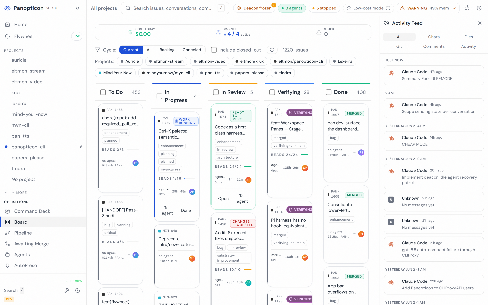
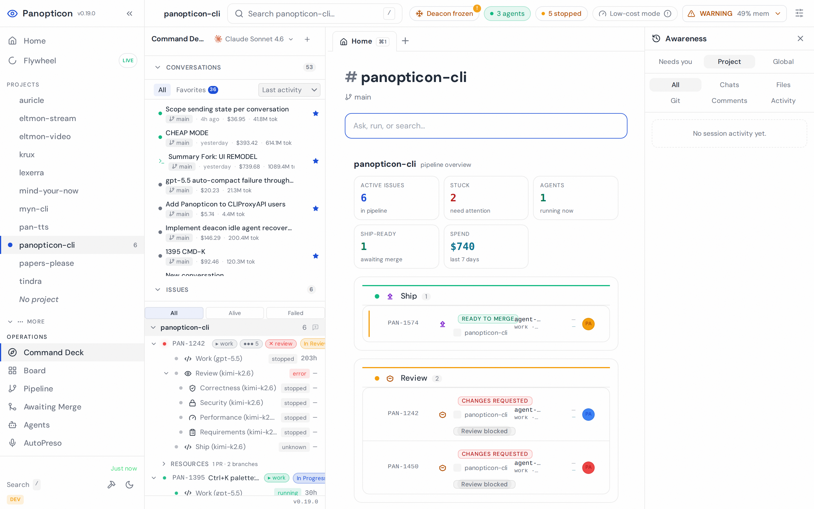

<div align="center">

<picture>
  <source media="(prefers-color-scheme: dark)" srcset="logo/overdeck-dark.svg">
  
</picture>

**The IDE for the agent era**

[](https://www.npmjs.com/package/@overdeck/core)
[](https://opensource.org/licenses/MIT)
[](https://nodejs.org/)
[](https://github.com/eltmon/overdeck/pulls)
[](https://github.com/sponsors/eltmon)

</div>

IDEs were built for humans who type code. Overdeck is built for humans who **direct** it. One agent or twenty, hands-on or hands-off: spawn agents on real issues, watch every diff land live, steer mid-task, and let a built-in specialist pipeline review, test, and merge the work — while you decide exactly how much of that loop runs without you.

<div align="center">

<picture>
  <source media="(prefers-color-scheme: dark)" srcset="docs/screenshot-board-dark.png">
  
</picture>

</div>

## Quick Start

```bash
npx @overdeck/core
```

No install step required. `npx @overdeck/core` starts Command Deck and opens the dashboard in your browser. Use `overdeck` or `pan` after `npm install -g @overdeck/core`. The packaged desktop app is published separately as `@overdeck/desktop`.

Dashboard runs at https://pan.localhost (or http://localhost:3011 if you skip HTTPS setup).

See the [full documentation](https://docs.overdeck.ai) for detailed setup, configuration, and usage guides.

---

## The Autonomy Dial

Overdeck's core idea is that **how much you supervise should be your choice, per issue, per day** — not a property of the tool. The same pipeline serves three working styles:

| Mode | You do | Overdeck does |
|:-----|:-------|:--------------|
| **Pair** | Watch diffs land live, steer the agent in the composer, swap models mid-task | Runs one agent in an isolated workspace with checkpoints and live cost tracking |
| **Pipeline** | Write the issue, click Merge at the end | Plans with a PRD, implements, runs a four-lens review convoy, tests, UAT, and queues the merge train |
| **Flywheel** | Review the morning recap | Picks up backlog issues, drives them end-to-end in parallel, files and fixes what it finds along the way |

Most sessions live somewhere between — you pair on the gnarly issue while the pipeline ships three routine ones behind you.

---

## Command Deck

Command Deck is the live development surface where you and your agents work together. It's built around three zones that update in real time — no refresh buttons, no polling. Every event animates in as it happens.

| Zone | What You See |
|:-----|:-------------|
| **Issue Header** | Issue identity, pipeline stage, live cost tracking, activity sparkline, quality gate rollup |
| **Agent Context** | Selected agent's role, status, current tool, thinking/waiting state, round history, per-session costs |
| **Conversation + Composer** | Full conversation timeline with composer, or a tabbed dashboard when viewing the issue itself |

### What You Can Do

- **Live diffs as agents code** — every file change appears inline as the agent works. Open the diff panel to review changes turn by turn, or hit "vs main" to see the full picture without waiting for a PR.
- **Talk to your agents** — type in the composer to steer an agent mid-task. Correct its approach, point it at the right file, tell it to rethink — pair-programming, not babysitting.
- **Hot-swap models** — agent struggling? Open the model picker and switch from Sonnet to Opus (or Kimi, GPT, Gemini) without losing the conversation. Right model for each phase.
- **Branch to explore** — fork any conversation to try an alternative approach. Keep the original intact, compare both, merge the one you like.
- **Automatic checkpoints** — Command Deck snapshots agent state as work progresses. If an agent goes sideways, roll back to any earlier checkpoint instead of starting over.
- **Ship without switching tabs** — when the code looks right, the specialist pipeline picks it up. Automated review, tests, and merge. No CI dashboard to babysit.

### 13 Dashboard Views

Project tree, activity feed, kanban board, agent status, cost analytics, convoy status, specialist handoffs, real-time activity log, performance metrics, skill library, health diagnostics, God View (cross-project), and settings.

---

## Why Overdeck?

- **You stay in the loop without being in the way.** Watch agents code, review their diffs live, send a message when they drift. You're pair-programming, not babysitting a terminal.
- **The right model for every phase.** A frontier model plans the architecture, faster models write the code and handle mechanical steps. Overdeck routes automatically — or you override with two clicks when you know better.
- **Context that outlasts the conversation.** PRDs, plans, checkpoints, beads, and skills carry forward across sessions. Agents pick up where the last one left off, not from a blank slate.
- **One skill format, every tool.** Write a SKILL.md once and it works across Claude Code, Codex, Cursor, and Gemini CLI. 70+ ship out of the box.
- **A pipeline that ships while you move on.** When the implementation looks right, hand it to the specialist pipeline — a four-lens review convoy, automated tests, browser UAT, and a merge train that keeps main green. You click Merge when you're satisfied, or keep working on the next issue.
- **Built by itself.** Overdeck is developed with Overdeck: its own agents plan, implement, review, test, and merge most of its changes. Every rough edge in the pipeline gets hit by us before it gets hit by you.

---

## How It Works

```
 Issue         PRD           Agent         Review        Test          Merge
┌──────┐    ┌──────┐    ┌──────────┐    ┌──────┐    ┌──────┐    ┌──────────┐
│ Task │ ─► │ Plan │ ─► │ Write    │ ─► │ Code │ ─► │ Run  │ ─► │ Merge    │
│ from │    │ with │    │ code in  │    │ rev. │    │ test │    │ train    │
│ any  │    │vBRIEF│    │ isolated │    │ conv-│    │ +    │    │ keeps    │
│track-│    │ beads│    │ worktree │    │ oy ×4│    │ UAT  │    │ main     │
│ er   │    │      │    │          │    │      │    │      │    │ green    │
└──────┘    └──────┘    └──────────┘    └──────┘    └──────┘    └──────────┘
 GitHub
 Linear      Every stage is model-routed — frontier models plan and review,
 GitLab      fast models grind — and every stage can be overridden per agent.
 Rally
```

You can drive any stage from the dashboard, the CLI, or a webhook. Engage as much or as little as you want — from hands-on pair programming with a single agent to launching a fully autonomous pipeline across dozens of issues.

---

## Key Features

| Feature | Description |
|:--------|:------------|
| **Command Deck** | A live workspace where you watch agents code, review diffs inline, send messages, and manage everything from one surface |
| **Inline Diff Review** | See what changed file-by-file as the agent works, compare any turn against main — no waiting for a PR to review code |
| **Model Hot-Swap** | Switch an agent between providers mid-conversation. Six providers, automatic routing, or manual override |
| **Multi-Harness** | Agents run on Claude Code or Pi, with Codex support for GPT work agents — pick per role, per spawn |
| **Conversation Forking** | Branch a conversation to try a different approach. Keep the original, compare both, go with what works |
| **Automatic Checkpoints** | Agent state is snapshotted as it progresses — roll back to any earlier point if something goes wrong |
| **Visual Plans** | Work plans render as interactive DAGs so you can see dependencies, track acceptance criteria, and know what's done |
| **Specialist Pipeline** | Review convoy (correctness, security, performance, requirements), tests, per-bead inspection, browser UAT, and merge — you just click Merge |
| **Merge Trains** | Approved work queues onto main in order, each rebase re-verified, so a busy day of merges never breaks the build |
| **Fix-All Flywheel** | An autonomous orchestrator that pulls from the backlog, runs issues end-to-end in parallel, and files what it finds along the way |
| **Failsafe Controls** | Pause gates, troubled-agent backoff, boot-scoped no-resume, and a global freeze — autonomy you can always stop |
| **Cloister** | Lifecycle manager that routes models, detects stuck agents, tracks costs, and orchestrates specialist handoffs |
| **PRD-Driven Workflow** | A frontier model writes a detailed plan before any code is written — agents can't start without one |
| **70+ Universal Skills** | Pre-built skills synced on every `overdeck up` — one SKILL.md works across Claude Code, Codex, Cursor, and Gemini CLI |
| **Context Layers** | One set of rules rendered for every harness — universal, per-project, and per-machine context that agents actually receive |
| **Multi-Tracker Support** | GitHub Issues, Linear, GitLab, Rally — all visible in one unified kanban board |
| **Workspaces** | Isolated git worktrees per issue with optional Docker environments, local or remote via Fly.io |
| **Convoys** | Run parallel agents on related issues with automatic result synthesis |
| **Cost Tracking** | Per-issue, per-stage token costs with model attribution and daily rollups |
| **TLDR Code Analysis** | Token-efficient codebase understanding (500-1,200 tokens/file vs 10-25k) so agents stay within context |

---

## Architecture at a Glance

Overdeck started as a CLI and grew into **Command Deck**, a desktop-class development environment. The CLI, the GUI, and any script that can make an HTTP request all drive the same REST surface — spawn an agent from a kanban card, a terminal, or a webhook without switching tools. Under the hood: an Effect.js + TypeScript server, a React frontend over typed WebSocket RPC, SQLite for state, and Electron as the shell. Launch with `npx @overdeck/core`; keep `pan` for headless and CI, or use `@overdeck/desktop` for the packaged desktop app.

---

## Screenshots

<div align="center">
<table>
<tr>
<td>
<picture>
  <source media="(prefers-color-scheme: dark)" srcset="docs/dashboard-overview-dark.png">
  
</picture>
</td>
<td></td>
</tr>
<tr>
<td align="center"><em>Command Deck — project tree, activity timeline, specialist pipeline</em></td>
<td align="center"><em>Cloister Deacon, specialist agents, and issue agent management</em></td>
</tr>
<tr>
<td colspan="2"></td>
</tr>
<tr>
<td colspan="2" align="center"><em>Tracker integration and capability-based model routing</em></td>
</tr>
</table>
</div>

---

## Supported Tools

| Tool | Support |
|:-----|:--------|
| **Claude Code** | Full support — agent runtime, hooks, skills |
| **Pi** | Alternative multi-provider agent harness |
| **Codex** | Skills sync and OpenAI subscription login for GPT work agents |
| **Cursor** | Skills sync |
| **Gemini CLI** | Skills sync |
| **Google Antigravity** | Skills sync |

---

## Requirements

### Required
- Node.js 22+
- Git (for worktree-based workspaces)
- Docker (for Traefik and workspace containers)
- tmux (for agent sessions)
- **GitHub CLI (`gh`)** or **GitLab CLI (`glab`)** for Git operations
- **ttyd** - Auto-installed by `pan install`

### Optional
- **mkcert** - For HTTPS certificates (recommended)
- **Linear API key** - For Linear issue tracking
- **Beads CLI** - Auto-installed by `pan install`

---

## Maturity

Overdeck is actively used in production to develop itself and multiple other projects. Most of the code in this repository was planned, written, reviewed, tested, and merged by Overdeck's own pipeline.

- **2,200+ issues** filed against this repo; hundreds shipped end-to-end through the pipeline
- **70+ skills** shipped and synced across tools
- **4 tracker integrations** (GitHub, Linear, GitLab, Rally)
- **6 AI providers** with capability-based model routing
- **5 specialist roles** in the automated quality pipeline

---

## Documentation

Full documentation at **[docs.overdeck.ai](https://docs.overdeck.ai)**

| Document | Description |
|----------|-------------|
| [Quick Start](https://docs.overdeck.ai/quickstart) | Installation and setup |
| [Core Concepts](https://docs.overdeck.ai/concepts) | Architecture and key concepts |
| [CLI Reference](https://docs.overdeck.ai/cli/overview) | All available commands |
| [Features](https://docs.overdeck.ai/features/mission-control) | Deep dive into key features |
| [Guides](https://docs.overdeck.ai/guides/legacy-codebases) | Step-by-step guides |

---

## Support Overdeck

Overdeck is free, MIT-licensed, and built by one developer directing a fleet of agents. The fleet isn't free — the model bills behind Overdeck's own development run about **$1,000/month**, all self-funded.

If Overdeck saves you time, [**sponsoring on GitHub**](https://github.com/sponsors/eltmon) directly keeps the agents running. Even $5/month genuinely helps.

---

## Contributing

Contributions welcome! See [CONTRIBUTING.md](CONTRIBUTING.md) for guidelines.

---

## License

MIT License - see [LICENSE](LICENSE) for details.

---

<div align="center">
<p><a href="https://github.com/eltmon/overdeck">GitHub</a> · <a href="https://www.npmjs.com/package/@overdeck/core">npm</a> · <a href="https://docs.overdeck.ai">Documentation</a> · <a href="https://github.com/sponsors/eltmon">Sponsor</a></p>
</div>
