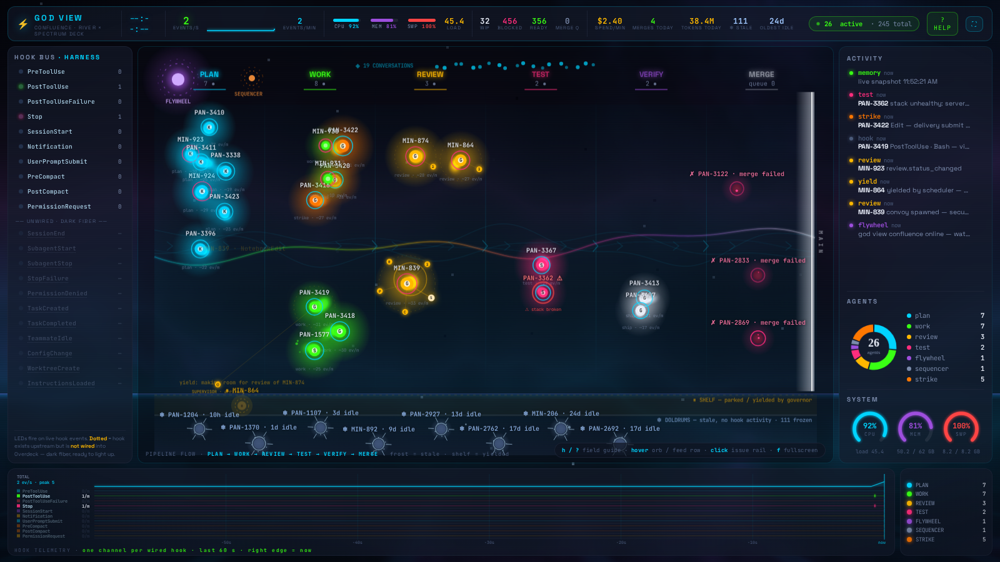

# God View: Confluence

Confluence is the production center canvas at `/god-view`. It combines the
pipeline geography from the River mockup with the live telemetry language from
Spectrum Deck, while keeping every displayed issue, agent, hook event, cost,
and status grounded in dashboard state.

## What Confluence shows

- **The river engine** places issue orbs in the `PLAN → WORK → REVIEW → TEST →
  VERIFY → MERGE` flow. The WebGL aurora reacts to live hook energy, with a
  canvas-only background when WebGL is unavailable.
- **Issue orbs** encode project, role, model glyph, stage, heat, and operational
  state. Review convoys orbit one issue orb so parallel reviewers remain one
  pipeline unit rather than appearing as unrelated work.
- **Agent micro-states** show waiting, thinking, compaction, cost pulses, stack
  warnings, and merge activity on the orb that owns the work.
- **The shelf and Doldrums** separate yielded or paused work from stalled work.
  Frost accrues gradually from real idle time before an orb settles into the
  Doldrums; governor tides move yielded work to the shelf. The Doldrums is
  also the parked population's home (see "The Stall Sweeper" below).
- **The merge portal and wrecks** show the path into `main`, queued merge depth,
  successful merge motion, and failed merge residue.
- **The Stall Sweeper** (PAN-3490) renders the parked population and the
  sweeper's work: parked orbs settle in the Doldrums with orbit-tinted frost
  and an orbit tag; an ice-blue lantern beam sweeps the band on every real
  population change, glinting each orb the scan touched; a released orb thaws
  back into the river; an operator-only release fires a slow-rising signal
  flare. The 🧹 PARKED top-bar stat is the true census, and VEL/h shows real
  stage-transition rate.
- **The Flywheel sun and sequencer** show orchestration activity. The
  conversation constellation above the river shows the live conversation
  count.
- **The hook bus** renders the 21-entry contracts inventory in canonical order.
  Wired hooks receive event-driven LEDs and counters; unwired hooks remain dim
  dark fiber with an em dash rather than invented activity.
- **The bottom telemetry strip** draws one 60-second channel per wired hook,
  real event ticks, burst intensity, aggregate events per second, and the live
  role-count box. No decorative event bands are generated.
- **The activity feed and orbs are linked.** Hovering an issue-linked feed row
  opens its full provenance tooltip and flashes the matching orb; clicking the
  row or orb opens `/issues/<id>` in the real issue drawer.
- **The enriched top bar** shows the clock, event rate and ECG, CPU, memory,
  swap, load, WIP, blocked and ready counts, merge queue, cost rate, merges,
  tokens, stale count, oldest idle age, active count, help, and fullscreen.
  Missing sources render `—` instead of a fabricated zero.

## Glyph language

| Glyph | Meaning |
| --- | --- |
| Orb | One issue and its current primary agent role |
| Orbiting satellites | Review convoy members attached to the same issue |
| Shelf | Paused or scheduler-yielded work that still belongs to the pipeline |
| Frost / Doldrums | Increasing idle age and work that crossed the stale threshold |
| Orbit-tinted frost | A parked issue — the frost color names its orbit (amber stuck, orange UAT, pink merge-failed, purple conflicts, ash zombie, ice idle) |
| Sweeper beam | A real parked-population scan (sweep.scan) crossing the Doldrums |
| Thaw | A stale orb whose refreshed state confirms it is active again, returning to the river |
| Signal flare | A parked orb only a human can release (sweep.escalated) |
| Portal / wreck | Merge path into `main` and failed merge residue |
| Flywheel sun / sequencer | Orchestration source and dispatch cadence |
| Hook bus LED | A real event from a wired harness hook |
| Telemetry trace | Real wired-hook events over the latest 60 seconds |

Model glyphs are compact labels inside active orbs. Their surrounding color
still comes from the issue's role and project, so the glyph supplements the
orb language rather than replacing it.

## Interactions

- Hover an orb for its issue, stage, role, project, state, model, harness, hook
  rate, frost, event count, stale age, yield reason, warning, and convoy data.
- Click an orb or an issue-linked activity row to open the real issue drawer.
- Hover an issue-linked activity row to show the source, full message, and
  timestamp while flashing the matching orb.
- Press `h` or `?` to toggle the field guide, `Escape` to close it, and `f` to
  toggle fullscreen. Shortcuts do nothing while a text field or another modal
  owns focus.

## Data flow and honesty contract

The river cast comes from the shared dashboard snapshot and Zustand read model.
`EventRouter` receives the snapshot and subsequent domain events over `/ws/rpc`;
`useConfluenceData()` derives orbs, hook energy, micro-states, and metadata from
that same state. The parked cast comes from `GET /api/parked` fetched once and
invalidated only by a real `sweep.scan` domain event when the parked population
changes — no polling loop and no synthesized motion. Velocity
(`GET /api/velocity`) refreshes on the inherited 30-second cadence shared with
the host-health and cost queries. Harness heartbeats become domain events
before they enter the hook stream, so Confluence adds no polling loop for river
or hook animation.
The inherited host-health query and activity-feed REST fallback keep their
existing polling cadence, but they do not synthesize visual events.

The contract is **cast real, motion real**:

- **Cast real:** every issue, agent, conversation, hook, role count, queue depth,
  and health value comes from a real source. An unavailable source displays
  `—`, dark fiber, or an empty state.
- **Motion real:** animation visualizes a real transition or current state.
  Hook sparks require hook events, frost requires idle time, governor tides
  require yielding, merge motion requires merge state, and trace marks require
  events in the visible window.

The center canvas is intentionally exempt from the normal dashboard style guide
so the dense ambient visualization can preserve the approved Confluence visual
language. Dashboard controls and data-door rules still apply.

## Implementation map

- Page composition: `src/dashboard/frontend/src/components/GodView/index.tsx`
- Shared live data: `src/dashboard/frontend/src/components/GodView/confluence/useConfluenceData.ts`
- River and effects engine: `src/dashboard/frontend/src/components/GodView/confluence/RiverCanvas.tsx`
- Hook rail: `src/dashboard/frontend/src/components/GodView/confluence/HookBus.tsx`
- Telemetry strip: `src/dashboard/frontend/src/components/GodView/confluence/BottomStrip.tsx`
- Field guide: `src/dashboard/frontend/src/components/GodView/confluence/ConfluenceHelp.tsx`
- Approved mockup: `design/style-guide/mockups/god-view-confluence.html`
