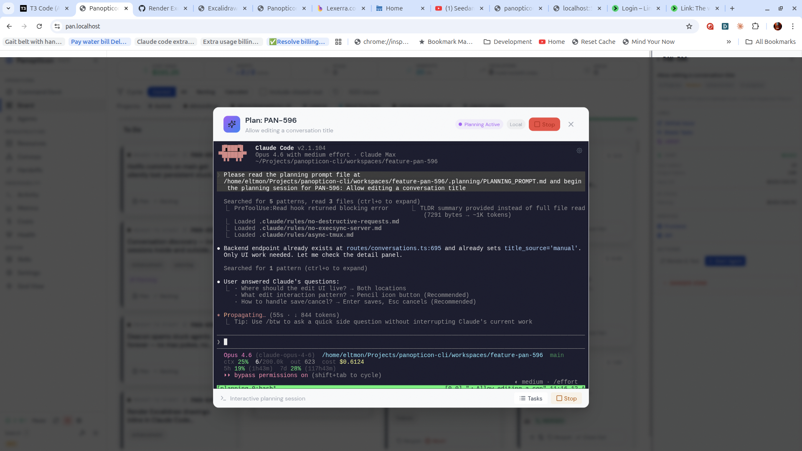

# Hierarchical Planning Strategy

**How Panopticon structures planning across tracker hierarchies, using vBRIEF as the planning format and PRDs as human-authored input.**

---

## Overview

Panopticon separates **requirements** (human intent) from **plans** (structured agent output) using two distinct artifact types:

- **PRD** — A human-authored markdown document describing requirements, context, and intent. Written before or alongside issue creation. Lives in `docs/prds/`.
- **vBRIEF Plan** — A structured JSON document produced by Opus during the planning phase. Contains acceptance criteria, dependency DAGs, story decomposition, and architectural decisions. Created in `.planning/` during planning, then promoted to `vbrief/` lifecycle directories.

This separation resolves the historical conflation where both the human requirements doc and the agent's implementation plan were called "PRD."

### The Planning Pipeline

```
PRD (human, markdown)              ← requirements & intent
  → issue filed in tracker         ← tracked work unit
    → Opus reads PRD + codebase    ← discovery phase
      → vBRIEF Plan (structured)   ← machine-validated plan
        → beads (execution tasks)  ← agent work items
          → implementation         ← code changes
```

### Tracker-Specific Behavior

Planning depth adapts to the tracker's native hierarchy:

| Tracker | Planning Level | vBRIEF Scope | Beads Live At | Workspace Unit |
|---------|---------------|--------------|---------------|----------------|
| Rally   | Feature       | Feature (with story items) | Story | Story |
| Linear  | Issue         | Issue | Issue | Issue |
| GitHub  | Issue         | Issue | Issue | Issue |

The core principle: **plan at the highest natural unit your tracker provides, execute at the lowest.**

---

## Artifact Lifecycle

| Artifact | Author | Format | When Created | Where It Lives | Purpose |
|----------|--------|--------|-------------|----------------|---------|
| **PRD** | Human | Markdown (`.md`) | Before or alongside issue filing | `docs/prds/` | Requirements, intent, context |
| **vBRIEF Plan** | Opus | JSON (`.vbrief.json`) | During planning phase | `vbrief/{proposed,active,completed,cancelled}/` | Structured plan with acceptance criteria, dependency DAG |
| **Continue State** | Agent/System | JSON (`.vbrief.json`) | During planning/execution | `vbrief/active/` (alongside scope vBRIEF) | Operational state, decisions, hazards, resume point, session history |
| **Beads** | Opus → Agent | git-backed DB | Planning → execution | `.beads/` in workspace | Granular implementation tasks |

### Where Artifacts Live

```
docs/prds/
  active/MIN-630-auth-redesign.md     ← human PRD (requirements)
  completed/MIN-612-dashboard.md      ← archived after merge

vbrief/
  proposed/
    2026-05-01-MIN-630-auth-redesign.vbrief.json  ← scope vBRIEF (awaiting approval)
  active/
    2026-04-28-PAN-714-bar.vbrief.json            ← scope vBRIEF (agent working)
    continue-PAN-714.vbrief.json                  ← session state
  completed/
    2026-04-20-MIN-612-dashboard.vbrief.json      ← archived after merge

workspaces/feature-US101/
  .planning/
    plan.vbrief.json                  ← draft vBRIEF (during planning, before promotion)
  .beads/                             ← execution tasks
  src/                                ← implementation
```

---

## vBRIEF Plan Format

Panopticon adopts [vBRIEF](https://github.com/deftai/vBRIEF) (Basic Relational Intent Exchange Format) as its structured planning format. vBRIEF provides:

- **Graduated complexity** — A bug fix plan needs 4 fields. A multi-story feature gets a full DAG.
- **Forced acceptance criteria** — Each requirement is a typed PlanItem with status, not a freeform checkbox.
- **Dependency DAG** — `edges` array with typed relationships (`blocks`, `informs`, `invalidates`, `suggests`).
- **Narratives** — Structured rationale at plan and item level (`Problem`, `Constraint`, `Risk`, `Alternative`).
- **planRef** — Feature plans reference story plans via URI, enabling modular decomposition.
- **JSON Schema validation** — Plans can be programmatically verified before handoff to execution.
- **Token efficiency** — Optional TRON encoding (35-40% savings) when injecting plans into agent context.

### Example: Single-Issue Plan (Linear/GitHub)

```json
{
  "vBRIEFInfo": { "version": "0.5" },
  "plan": {
    "title": "MIN-630: Redesign Daily Briefing",
    "status": "approved",
    "narratives": {
      "Problem": "Current briefing is a wall of text with no actionable structure",
      "Constraint": "Must work on mobile (Capacitor) — no hover states",
      "Risk": "Breaking change to briefing API response shape"
    },
    "items": [
      {
        "id": "api.response",
        "title": "Restructure briefing API response",
        "status": "pending",
        "narrative": "Split monolithic response into sections: urgency_zones, habit_streaks, recommendations",
        "metadata": { "kind": "requirement", "priority": "high" },
        "subItems": [
          {
            "id": "api.response.ac1",
            "title": "Response includes urgency_zones array with time-bucketed tasks",
            "status": "pending",
            "metadata": { "kind": "acceptance_criterion" }
          },
          {
            "id": "api.response.ac2",
            "title": "Backward-compatible: old clients ignore new fields",
            "status": "pending",
            "metadata": { "kind": "acceptance_criterion" }
          }
        ]
      },
      {
        "id": "ui.cards",
        "title": "Card-based briefing layout",
        "status": "pending",
        "narrative": "Replace text wall with swipeable cards per urgency zone"
      }
    ],
    "edges": [
      { "from": "api.response", "to": "ui.cards", "type": "blocks" }
    ]
  }
}
```

### Example: Feature Plan (Rally)

For Rally Features, the vBRIEF plan operates at the feature level and decomposes into stories:

```json
{
  "vBRIEFInfo": { "version": "0.5" },
  "plan": {
    "title": "F1234: User Authentication Redesign",
    "status": "approved",
    "narratives": {
      "Problem": "Session-based auth doesn't support mobile clients",
      "Constraint": "Must maintain backward compatibility during rollout",
      "Alternative": "Considered JWT-only but PKCE provides better security for SPAs"
    },
    "items": [
      {
        "id": "ad.oauth2",
        "title": "AD-1: OAuth2 with PKCE for all client types",
        "status": "approved",
        "narrative": "Mobile and SPA clients need stateless auth. PKCE prevents authorization code interception.",
        "metadata": { "kind": "architectural_decision" }
      },
      {
        "id": "story.US100",
        "title": "US100: Database Migration",
        "status": "pending",
        "narrative": "Create auth_sessions table (Flyway V42). No UI, no API — pure schema change.",
        "planRef": "file://vbrief/active/2026-04-15-US100-database-migration.vbrief.json",
        "metadata": { "kind": "story", "rally_ref": "US100" }
      },
      {
        "id": "story.US101",
        "title": "US101: Login Flow",
        "status": "pending",
        "narrative": "Implement /auth/token endpoint per AD-1. Login page UI with redirect handling.",
        "planRef": "file://vbrief/active/2026-04-15-US101-login-flow.vbrief.json",
        "metadata": { "kind": "story", "rally_ref": "US101" }
      },
      {
        "id": "story.US102",
        "title": "US102: Token Refresh",
        "status": "pending",
        "planRef": "file://vbrief/active/2026-04-15-US102-token-refresh.vbrief.json",
        "metadata": { "kind": "story", "rally_ref": "US102" }
      }
    ],
    "edges": [
      { "from": "story.US100", "to": "story.US101", "type": "blocks" },
      { "from": "story.US101", "to": "story.US102", "type": "blocks" },
      { "from": "ad.oauth2", "to": "story.US101", "type": "informs" }
    ]
  }
}
```

Key differences from single-issue plans:
- Items include `planRef` URIs pointing to story-level vBRIEF plans
- Architectural decisions (`kind: "architectural_decision"`) live at the feature level
- `edges` model cross-story dependencies that Cloister uses for ordering
- Story items carry `rally_ref` metadata linking back to Rally artifacts

---

## Planning Dialog UI

The planning agent uses an interactive dialog in Claude Code to guide users through the planning process and display the generated vBRIEF plan:



This dialog captures user input, displays the vBRIEF plan structure, and manages the transition from planning to execution.

---

## How It Works

### Linear / GitHub: Single-Level vBRIEF

1. Human writes PRD in `docs/prds/active/` (optional but recommended)
2. `pan plan <issue-id>` triggers Opus planning
3. Opus reads PRD + issue + codebase → produces `plan.vbrief.json`
4. vBRIEF items with acceptance criteria are validated against schema
5. Beads are created from vBRIEF items (one bead per actionable item)
6. One workspace, beads execute within it

### Rally: Feature-Level vBRIEF with Story Decomposition

#### Phase 1: Feature Planning

When `pan plan` targets a Rally Feature (`PortfolioItem/Feature`):

1. Human writes PRD for the feature (optional but recommended)
2. Opus fetches the Feature and all child User Stories from Rally
3. Opus reads PRD + Rally artifacts + codebase → produces feature-level `plan.vbrief.json`
4. The plan contains:
   - Architectural decisions shared across stories
   - Story items with `planRef` URIs to (future) story plans
   - Cross-story dependency edges
   - Shared contracts and data models in narratives
5. No beads at the feature level — beads are a story concern

#### Phase 2: Story Execution

For each User Story under the Feature:

1. Workspace created per story (standard worktree model)
2. Story planning inherits the feature-level vBRIEF as context
3. Opus produces a story-level `plan.vbrief.json` with:
   - Acceptance criteria from Rally + feature plan constraints
   - Implementation items scoped to this story
4. Beads created from story-level vBRIEF items
5. Agents execute, specialists review/test/merge
6. Cloister uses feature-level `edges` to order story workspace spawning

---

## Cross-Story Dependencies

The feature-level vBRIEF plan uses four edge types from the vBRIEF spec:

| Edge Type | Meaning | Cloister Behavior |
|-----------|---------|-------------------|
| `blocks` | Hard dependency — target cannot start until source completes | Target story workspace not spawned until blocking story merges |
| `informs` | Soft dependency — target benefits from source context | Target can proceed, but source's output is injected as context |
| `invalidates` | Source completion makes target unnecessary | Target story skipped if source completes |
| `suggests` | Weak recommendation, no dependency | Advisory only, no scheduling impact |

---

## PRD vs vBRIEF: When to Use Which

| Question | Answer |
|----------|--------|
| Writing requirements before filing an issue? | **PRD** (markdown) |
| Capturing stakeholder intent and context? | **PRD** (markdown) |
| Structuring acceptance criteria for agent execution? | **vBRIEF** (JSON) |
| Modeling dependencies between work items? | **vBRIEF** (edges) |
| Tracking which acceptance criteria passed? | **vBRIEF** (item status) |
| Feeding context into an agent's prompt? | **vBRIEF** (optionally TRON-encoded) |

The PRD is input. The vBRIEF plan is output. They are complementary, not competing.

---

## FAQ

### Why adopt vBRIEF instead of continuing with markdown plans?

Markdown plans are freeform — agents can skip acceptance criteria, dependencies are parsed from text, and there's no programmatic validation. vBRIEF provides schema validation, typed dependency DAGs, forced acceptance criteria structure, and token-efficient encoding. For an orchestration tool that hands structured work to autonomous agents, structured plans are essential.

### What happened to `.planning/PRD.md`?

The agent-generated `.planning/PRD.md` is replaced by the vBRIEF plan (created in `.planning/plan.vbrief.json` during planning, then promoted to `vbrief/proposed/`). The human-written PRD in `docs/prds/` remains unchanged. This resolves the naming collision where two different artifacts were both called "PRD."

### What happened to `STATE.md`?

STATE.md is replaced by `continue-<issueId>.vbrief.json` — a structured JSON file that captures the same information (decisions, hazards, resume points) in a machine-parseable format, plus git state, beads mapping, agent model, and session history. See [VBRIEF.md § Continue State](./VBRIEF.md#continue-state--structured-session-history).

### Where do vBRIEFs live now?

Scope vBRIEFs live in `vbrief/` lifecycle directories at the project root (`proposed/`, `active/`, `completed/`, `cancelled/`). During planning, the draft lives at `.planning/plan.vbrief.json` in the workspace. On planning completion, it's promoted to `vbrief/proposed/` with an issue-keyed filename. See [VBRIEF.md § Lifecycle Model](./VBRIEF.md#lifecycle-model).

### Why is vBRIEF at the feature level for Rally but issue level for Linear?

The vBRIEF plan always lives at the highest planning unit. For Rally, that's the Feature (which decomposes into stories). For Linear/GitHub, that's the issue itself. The plan scope matches the tracker's natural hierarchy.

### Do I have to write a PRD before planning?

No. The PRD is recommended but optional. If no PRD exists, Opus builds the vBRIEF plan from the issue description and codebase exploration alone. The PRD enriches the plan with human context that the issue description may not capture.

### Why not plan at the feature level for all trackers?

Linear and GitHub issues are already at the feature level. Adding story decomposition would mean inventing sub-issues that don't exist in the tracker. The hierarchy should come from the tracker, not be imposed by Panopticon.

### Why don't features get their own workspace?

Features are a planning artifact, not an execution unit. Code changes happen in stories. Creating a feature-level workspace would break the 1:1 worktree model and add complexity without enabling new capability.

### How does Cloister know about cross-story dependencies?

The feature-level vBRIEF plan's `edges` array is parsed when story workspaces are created. Cloister maintains a feature-level dependency map and only spawns story workspaces whose `blocks` dependencies are satisfied.

### What about beads dependencies across stories?

Beads remain story-scoped. Cross-story ordering is handled at the Cloister level via the vBRIEF dependency graph. This keeps beads simple and workspace-local.

### Does this change anything for bug fixes?

No. Bug fixes and small tasks use single-issue vBRIEF plans with minimal structure (graduated complexity). The feature-level flow only activates for Rally Features.

### Can agents produce valid vBRIEF JSON reliably?

Yes. LLMs are good at producing structured JSON when given a schema and examples. The vBRIEF schema is simple (4 required fields minimum), and Opus's planning prompts will include the schema and examples. JSON Schema validation catches malformed output before it reaches execution.

---

## Automatic Beads Conversion

When the planning agent finishes and the vBRIEF is promoted to `vbrief/proposed/`, Cloister automatically converts the vBRIEF plan into beads:

1. **Read** `plan.vbrief.json` from the workspace
2. **Topological sort** items using Kahn's algorithm on `blocks` edges
3. **Create beads** in dependency order via `bd create` with:
   - Title: `"{plan.id}: {item.title}"`
   - Labels: `issueLabel,difficulty:X,phase-N`
   - Description: Narrative Action + acceptance criteria
   - Dependencies: `--deps "blocks:beadId1,blocks:beadId2"`
4. **Start work agent** with beads ready for implementation

Implementation: `createBeadsFromVBrief()` in `src/lib/vbrief/beads.ts`.

## DAG Visualization

The dashboard visualizes the vBRIEF DAG using the dependency edges between items. The `criticalPath()` function in `src/lib/vbrief/dag.ts` computes the longest dependency chain using a longest-path algorithm over `blocks` edges. This highlights the critical path that determines the minimum time to complete all work.

## DAG-Aware Task Scheduling

Work agents use `bd ready -l <issue>` to find unblocked beads — tasks whose dependencies are all closed. This ensures work proceeds in dependency order without manual scheduling. The DAG structure from vBRIEF edges is preserved in beads dependencies during the automatic conversion.

## AC-Driven Specialist Pipeline

Acceptance criteria (`subItems` with `metadata.kind: "acceptance_criterion"`) flow through the entire specialist pipeline:

| Stage | AC Usage |
|-------|----------|
| **Work agent** | Sees AC per bead as completion checklist |
| **Inspect agent** | Verifies per-bead AC against the diff |
| **Review agent** | Full AC list for implementation coverage verification |
| **Test agent** | Maps test results to AC, flags untested criteria |
| **Verification gate** | Hard-gates on all AC subItems completed |
| **Merge agent** | Final AC validation before merge |
| **pan done** | Blocks completion on incomplete AC |

The shared utilities in `src/lib/vbrief/acceptance-criteria.ts` provide:
- `extractAcceptanceCriteria()` — reads plan and returns AC with parent context
- `formatAcceptanceCriteria()` — renders AC as markdown checklist
- `checkAllCriteriaCompleted()` — returns completion status
- `getVBriefACStatus()` — per-item AC counts for gates and prompts

---

## Related Documentation

- [vBRIEF Specification](https://github.com/deftai/vBRIEF) — The format specification
- [SPECIALIST_WORKFLOW.md](./SPECIALIST_WORKFLOW.md) — Specialist pipeline (review, test, merge)
- [PRD-CLOISTER.md](./PRD-CLOISTER.md) — Cloister lifecycle manager
- [AGENTS.md](../AGENTS.md) — Agent system architecture
- [WORK-TYPES.md](./WORK-TYPES.md) — Model routing for different work types
