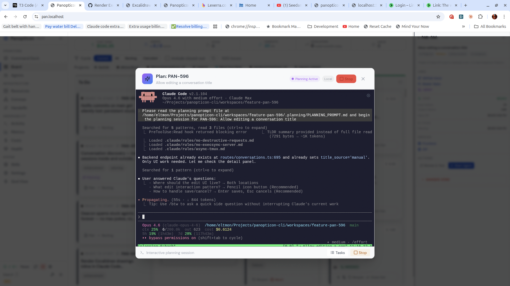

# Hierarchical Planning Strategy

**How Overdeck structures planning across tracker hierarchies, using xBRIEF as the planning format and PRDs as human-authored input.**

---

## Overview

Overdeck separates **requirements** (human intent) from **plans** (structured agent output) using two distinct artifact types:

- **PRD** — A human-authored markdown document describing requirements, context, and intent. Overdeck-managed drafts live in `drafts/<issue>.md` on `overdeck-state`; projects may also maintain their own PRDs under `docs/prds/`.
- **xBRIEF plan** — A structured JSON document produced during planning. It contains acceptance criteria, dependency DAGs, story decomposition, and architectural decisions. Planning writes the immutable canonical spec to `specs/*.xbrief.json` on `overdeck-state`.

This separation resolves the historical conflation where both the human requirements document and the agent's implementation plan were called a PRD.

### The Planning Pipeline

```
PRD (human, markdown)              ← requirements & intent
  → issue filed in tracker         ← tracked work unit
    → Opus reads PRD + codebase    ← discovery phase
      → xBRIEF Plan (structured)   ← machine-validated plan
        → tasks (execution tasks)  ← agent work items
          → implementation         ← code changes
```

### Tracker-Specific Behavior

Planning depth adapts to the tracker's native hierarchy:

| Tracker | Planning Level | xBRIEF Scope | tasks Live At | Workspace Unit |
|---------|---------------|--------------|---------------|----------------|
| Rally   | Feature       | Feature (with story items) | Story | Story |
| Linear  | Issue         | Issue | Issue | Issue |
| GitHub  | Issue         | Issue | Issue | Issue |

The core principle: **plan at the highest natural unit your tracker provides, execute at the lowest.**

---

## Artifact Lifecycle

| Artifact | Author | Format | When Created | Where It Lives | Purpose |
|----------|--------|--------|-------------|----------------|---------|
| **PRD** | Human or planning agent | Markdown (`.md`) | Before or during planning | `drafts/<issue>.md` on `overdeck-state` | Requirements, intent, context |
| **xBRIEF plan** | Planning pipeline | JSON (`.xbrief.json`) | When planning finalizes | `specs/<date>-<issue>-<slug>.xbrief.json` on `overdeck-state` | Immutable plan with acceptance criteria and dependency DAG |
| **Project continue state** | Pipeline | JSON (`.xbrief.json`) | During planning/execution | `continues/<issue>.xbrief.json` on `overdeck-state` | Durable decisions, hazards, feedback, and session history |
| **Workspace continue state** | Pipeline and work agent | JSON (`.json`) | During execution | `.overdeck/continue.json` | Item and sub-item `statusOverrides`, plus the current resume point |

### Where Artifacts Live

```
${OVERDECK_HOME}/state/<project>/
├── drafts/
│   └── min-630.md
├── specs/
│   └── 2026-05-01-MIN-630-auth-redesign.xbrief.json
└── continues/
    └── min-630.xbrief.json

workspaces/feature-min-630/
├── .overdeck/
│   └── continue.json
└── src/
```

Older workspace compatibility filenames remain readable, but current planning does not create a workspace spec copy. See the [xBRIEF migration note](./XBRIEF.md) for the exact legacy surfaces.

---

## xBRIEF Plan Format

Overdeck adopts [xBRIEF](https://github.com/deftai/xBRIEF) (Basic Relational Intent Exchange Format) as its structured planning format. xBRIEF provides:

- **Graduated complexity** — A bug fix plan needs 4 fields. A multi-story feature gets a full DAG.
- **Forced acceptance criteria** — Each requirement is a typed PlanItem with status, not a freeform checkbox.
- **Dependency DAG** — `edges` array with typed relationships (`blocks`, `informs`, `invalidates`, `suggests`).
- **Narratives** — Structured rationale at plan and item level (`Problem`, `Constraint`, `Risk`, `Alternative`).
- **planRef** — Feature plans reference story plans via URI, enabling modular decomposition.
- **JSON Schema validation** — Plans can be programmatically verified before handoff to execution.
- **Token efficiency** — Optional TRON encoding (35-40% savings) when injecting plans into agent context.

### Example: Single-Issue Plan (Linear/GitHub)

```json
{
  "xBRIEFInfo": { "version": "0.8" },
  "plan": {
    "title": "MIN-630: Redesign Daily Briefing",
    "status": "approved",
    "narratives": {
      "Problem": "Current briefing is a wall of text with no actionable structure",
      "Constraint": "Must work on mobile (Capacitor) — no hover states",
      "Risk": "Breaking change to briefing API response shape"
    },
    "items": [
      {
        "id": "api.response",
        "title": "Restructure briefing API response",
        "status": "pending",
        "narrative": "Split monolithic response into sections: urgency_zones, habit_streaks, recommendations",
        "metadata": { "kind": "requirement", "priority": "high" },
        "subItems": [
          {
            "id": "api.response.ac1",
            "title": "Response includes urgency_zones array with time-bucketed tasks",
            "status": "pending",
            "metadata": { "kind": "acceptance_criterion" }
          },
          {
            "id": "api.response.ac2",
            "title": "Backward-compatible: old clients ignore new fields",
            "status": "pending",
            "metadata": { "kind": "acceptance_criterion" }
          }
        ]
      },
      {
        "id": "ui.cards",
        "title": "Card-based briefing layout",
        "status": "pending",
        "narrative": "Replace text wall with swipeable cards per urgency zone"
      }
    ],
    "edges": [
      { "from": "api.response", "to": "ui.cards", "type": "blocks" }
    ]
  }
}
```

### Example: Feature Plan (Rally)

For Rally Features, the xBRIEF plan operates at the feature level and decomposes into stories:

```json
{
  "xBRIEFInfo": { "version": "0.8" },
  "plan": {
    "title": "F1234: User Authentication Redesign",
    "status": "approved",
    "narratives": {
      "Problem": "Session-based auth doesn't support mobile clients",
      "Constraint": "Must maintain backward compatibility during rollout",
      "Alternative": "Considered JWT-only but PKCE provides better security for SPAs"
    },
    "items": [
      {
        "id": "ad.oauth2",
        "title": "AD-1: OAuth2 with PKCE for all client types",
        "status": "approved",
        "narrative": "Mobile and SPA clients need stateless auth. PKCE prevents authorization code interception.",
        "metadata": { "kind": "architectural_decision" }
      },
      {
        "id": "story.US100",
        "title": "US100: Database Migration",
        "status": "pending",
        "narrative": "Create auth_sessions table (Flyway V42). No UI, no API — pure schema change.",
        "planRef": "file://specs/2026-04-15-US100-database-migration.xbrief.json",
        "metadata": { "kind": "story", "rally_ref": "US100" }
      },
      {
        "id": "story.US101",
        "title": "US101: Login Flow",
        "status": "pending",
        "narrative": "Implement /auth/token endpoint per AD-1. Login page UI with redirect handling.",
        "planRef": "file://specs/2026-04-15-US101-login-flow.xbrief.json",
        "metadata": { "kind": "story", "rally_ref": "US101" }
      },
      {
        "id": "story.US102",
        "title": "US102: Token Refresh",
        "status": "pending",
        "planRef": "file://specs/2026-04-15-US102-token-refresh.xbrief.json",
        "metadata": { "kind": "story", "rally_ref": "US102" }
      }
    ],
    "edges": [
      { "from": "story.US100", "to": "story.US101", "type": "blocks" },
      { "from": "story.US101", "to": "story.US102", "type": "blocks" },
      { "from": "ad.oauth2", "to": "story.US101", "type": "informs" }
    ]
  }
}
```

Key differences from single-issue plans:
- Items include `planRef` URIs pointing to story-level xBRIEF plans
- Architectural decisions (`kind: "architectural_decision"`) live at the feature level
- `edges` model cross-story dependencies that Cloister uses for ordering
- Story items carry `rally_ref` metadata linking back to Rally artifacts

---

## Planning Dialog UI

The planning agent uses an interactive dialog in Claude Code to guide users through the planning process and display the generated xBRIEF plan:



This dialog captures user input, displays the xBRIEF plan structure, and manages the transition from planning to execution.

---

## How It Works

### Linear / GitHub: Single-Level xBRIEF

1. A human or planning agent writes `drafts/<issue>.md` on `overdeck-state` when the issue needs a PRD.
2. `pan plan <issue-id>` starts planning.
3. The planner reads the PRD, tracker issue, and codebase, then finalizes one canonical `specs/*.xbrief.json` file on `overdeck-state`.
4. Schema and readiness checks validate the xBRIEF items and acceptance criteria before work starts.
5. `pan task` exposes the plan items directly as the executable checklist; no second task store is materialized.
6. One workspace executes the issue, while item status changes are stored in `.overdeck/continue.json` as `statusOverrides`.

### Rally: Feature-Level xBRIEF with Story Decomposition

#### Phase 1: Feature Planning

When `pan plan` targets a Rally Feature (`PortfolioItem/Feature`):

1. A human or planning agent writes the feature PRD when needed.
2. The planner fetches the Feature and its child User Stories.
3. The planner creates a feature-level canonical xBRIEF in `specs/` on `overdeck-state`.
4. The plan contains:
   - Architectural decisions shared across stories
   - Story items with `planRef` URIs to story plans
   - Cross-story dependency edges
   - Shared contracts and data models in narratives
5. Feature-level items express coordination; story-level plans contain implementation work.

#### Phase 2: Story Execution

For each User Story under the Feature:

1. Overdeck creates a workspace per story.
2. Story planning inherits the feature-level xBRIEF as context.
3. Planning creates a story-level canonical xBRIEF in `specs/` with:
   - Acceptance criteria from Rally and feature-plan constraints
   - Implementation items scoped to the story
4. Work agents claim and complete story items through `pan task`.
5. Specialists review and test the completed work before merge.
6. Cloister uses feature-level `edges` to order story workspace spawning.

---

## Cross-Story Dependencies

The feature-level xBRIEF plan uses four edge types from the xBRIEF spec:

| Edge Type | Meaning | Cloister Behavior |
|-----------|---------|-------------------|
| `blocks` | Hard dependency — target cannot start until source completes | Target story workspace not spawned until blocking story merges |
| `informs` | Soft dependency — target benefits from source context | Target can proceed, but source's output is injected as context |
| `invalidates` | Source completion makes target unnecessary | Target story skipped if source completes |
| `suggests` | Weak recommendation, no dependency | Advisory only, no scheduling impact |

---

## PRD vs xBRIEF: When to Use Which

| Question | Answer |
|----------|--------|
| Writing requirements before filing an issue? | **PRD** (markdown) |
| Capturing stakeholder intent and context? | **PRD** (markdown) |
| Structuring acceptance criteria for agent execution? | **xBRIEF** (JSON) |
| Modeling dependencies between work items? | **xBRIEF** (edges) |
| Tracking which acceptance criteria passed? | **xBRIEF** (item status) |
| Feeding context into an agent's prompt? | **xBRIEF** (optionally TRON-encoded) |

The PRD is input. The xBRIEF plan is output. They are complementary, not competing.

---

## FAQ

### Why adopt xBRIEF instead of continuing with markdown plans?

Markdown plans are freeform — agents can skip acceptance criteria, dependencies are parsed from text, and there's no programmatic validation. xBRIEF provides schema validation, typed dependency DAGs, forced acceptance criteria structure, and token-efficient encoding. For an orchestration tool that hands structured work to autonomous agents, structured plans are essential.

### What happened to `.planning/PRD.md`?

Overdeck-managed PRD drafts now live at `drafts/<issue>.md` on `overdeck-state`. Projects may still maintain human-owned PRDs under `docs/prds/`, but the planner does not use `.planning/PRD.md`.

### What happened to `STATE.md`?

Project-side continue state lives at `continues/<issue>.xbrief.json` on `overdeck-state`, while mutable execution progress lives in `.overdeck/continue.json` inside the workspace. Together they preserve decisions, hazards, feedback, session history, resume points, and xBRIEF item `statusOverrides`. See [xBRIEF Continue State](./XBRIEF.md#continue-state--structured-session-history).

### Where do xBRIEFs live now?

Canonical xBRIEF specs live in `specs/*.xbrief.json` on `overdeck-state`; their lifecycle is represented by `plan.status`, so files do not move between status directories. Canonical project continue files live in `continues/*.xbrief.json`. See the [xBRIEF Lifecycle Model](./XBRIEF.md#lifecycle-model) and its migration note for legacy read compatibility.

### Why is xBRIEF at the feature level for Rally but issue level for Linear?

The xBRIEF plan always lives at the highest planning unit. For Rally, that's the Feature (which decomposes into stories). For Linear/GitHub, that's the issue itself. The plan scope matches the tracker's natural hierarchy.

### Do I have to write a PRD before planning?

No. The PRD is recommended but optional. If no PRD exists, Opus builds the xBRIEF plan from the issue description and codebase exploration alone. The PRD enriches the plan with human context that the issue description may not capture.

### Why not plan at the feature level for all trackers?

Linear and GitHub issues are already at the feature level. Adding story decomposition would mean inventing sub-issues that don't exist in the tracker. The hierarchy should come from the tracker, not be imposed by Overdeck.

### Why don't features get their own workspace?

Features are a planning artifact, not an execution unit. Code changes happen in stories. Creating a feature-level workspace would break the 1:1 worktree model and add complexity without enabling new capability.

### How does Cloister know about cross-story dependencies?

The feature-level xBRIEF plan's `edges` array is parsed when story workspaces are created. Cloister maintains a feature-level dependency map and only spawns story workspaces whose `blocks` dependencies are satisfied.

### What about tasks dependencies across stories?

tasks remain story-scoped. Cross-story ordering is handled at the Cloister level via the xBRIEF dependency graph. This keeps tasks simple and workspace-local.

### Does this change anything for bug fixes?

No. Bug fixes and small tasks use single-issue xBRIEF plans with minimal structure (graduated complexity). The feature-level flow only activates for Rally Features.

### Can agents produce valid xBRIEF JSON reliably?

Yes. LLMs are good at producing structured JSON when given a schema and examples. The xBRIEF schema is simple (4 required fields minimum), and Opus's planning prompts will include the schema and examples. JSON Schema validation catches malformed output before it reaches execution.

---

## Checklist Activation

When planning finishes, Overdeck promotes the xBRIEF to `specs/` on `overdeck-state`.
The plan items and their `blocks` edges are the task graph; planning does not convert
them into another store. A work agent starts only after the plan is readable and has
at least one implementation item.

## DAG Visualization

The dashboard visualizes the xBRIEF DAG using the dependency edges between items. The `criticalPath()` function in `src/lib/xbrief/dag.ts` computes the longest dependency chain using a longest-path algorithm over `blocks` edges. This highlights the critical path that determines the minimum time to complete all work.

## DAG-Aware Task Scheduling

Work agents use `pan task next <issue>` to find the next dispatchable checklist item whose blockers are terminal. This keeps work in dependency order without duplicating the xBRIEF graph in another store.

## AC-Driven Specialist Pipeline

Acceptance criteria (`subItems` with `metadata.kind: "acceptance_criterion"`) flow through the entire specialist pipeline:

| Stage | AC Usage |
|-------|----------|
| **Work agent** | Sees AC per task as completion checklist |
| **Inspect agent** | Verifies per-task AC against the diff (only on tasks flagged `metadata.requiresInspection: true`) |
| **Review agent** | Full AC list for implementation coverage verification |
| **Test agent** | Maps test results to AC, flags untested criteria |
| **Verification gate** | Hard-gates on all AC subItems completed |
| **Merge agent** | Final AC validation before merge |
| **pan done** | Blocks completion on incomplete AC |

The shared utilities in `src/lib/xbrief/acceptance-criteria.ts` provide:
- `extractAcceptanceCriteria()` — reads plan and returns AC with parent context
- `formatAcceptanceCriteria()` — renders AC as markdown checklist
- `checkAllCriteriaCompleted()` — returns completion status
- `getXBriefACStatus()` — per-item AC counts for gates and prompts

---

## Related Documentation

- [xBRIEF Specification](https://github.com/deftai/xBRIEF) — The format specification
- [SPECIALIST_WORKFLOW.md](./SPECIALIST_WORKFLOW.md) — Specialist pipeline (review, test, merge)
- [PRD-CLOISTER.md](./PRD-CLOISTER.md) — Cloister lifecycle manager
- [AGENTS.md](../AGENTS.md) — Agent system architecture
- [WORK-TYPES.md](./WORK-TYPES.md) — Model routing for different work types
