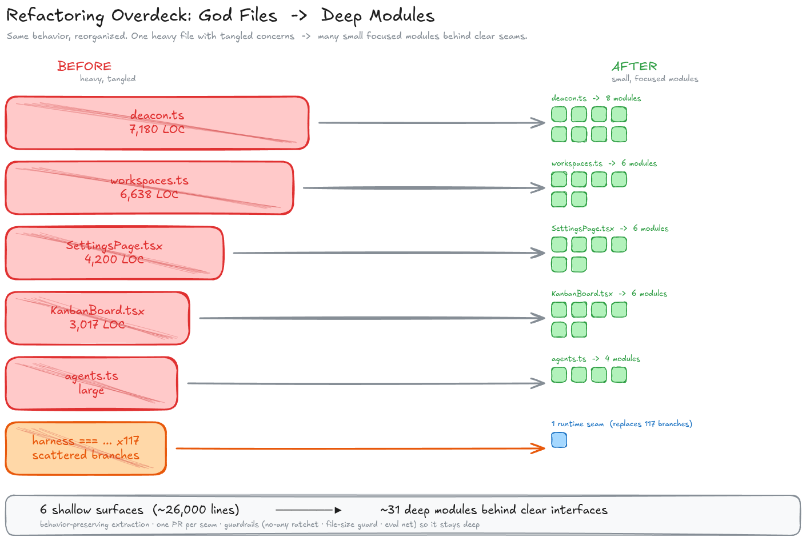
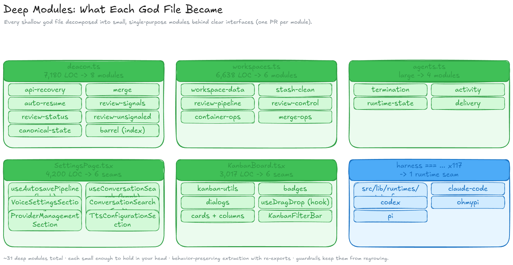

# Case Study: God Files → Deep Modules

A visual record of the 2026-06-28 codebase-health refactor — five "god files" (plus a
117-branch cross-cutting conditional) broken into ~31 focused modules in a single session,
behind guardrails that stop the rot from coming back.

See also: [`CODEBASE-HEALTH-ROADMAP.md`](./CODEBASE-HEALTH-ROADMAP.md) for the full epic status.

## Overview: shallow god files → deep modules

Each god file is shown sized to its line count, with tangled internals, shattering into a
cluster of small, single-purpose modules. The contrast — a few big tangled blocks vs. many
tidy tiles — is the point.

## Breakdown: what each god file became

| God file | Before | After |
| --- | --- | --- |
| `cloister/deacon.ts` | 7,180 LOC | 8 modules: api-recovery, merge, auto-resume, review-signals/status/unsignaled, canonical-state, barrel |
| `routes/workspaces.ts` | 6,638 LOC | 6 modules: workspace-data, stash-clean, review-pipeline, review-control, container-ops, merge-ops |
| `lib/agents.ts` | large | 4 modules: termination, activity, runtime-state, delivery |
| `SettingsPage.tsx` | 4,200 LOC | 6 seams: autosave + conversation-search hooks; voice / conversation-search / provider / tts sections |
| `KanbanBoard.tsx` | 3,017 LOC | 6 seams: utils, badges, dialogs, drag-drop hook, cards+columns, filter-bar |
| `harness === …` ×117 | scattered branches | 1 runtime seam (`src/lib/runtimes/*`) — *in progress* |

## Why this matters (the framing)

Per Ousterhout's *A Philosophy of Software Design*, these were **shallow modules**: lots of
surface area, little depth — the cost isn't lines of code, it's **how much you must hold in
your head to safely change one thing.** A **deep module** is small and focused behind a
clear interface, so the blast radius of a change is contained.

## How it was done

- **Behavior-preserving extraction** with re-exports — call sites unchanged, behavior identical.
- **One PR per seam** — small, reviewable, independently revertible.
- **AI agent fleet** — an orchestrating conversation supervised GPT-5.5 coding agents
  (handoff-style), one per seam, in parallel git worktrees.
- **Keystone-then-fan-out** for cross-cutting work: design the shared interface once
  (you can't parallelize a design), then fan out the call-site migration.

## Guardrails (what keeps it deep)

- `no-explicit-any` ESLint ratchet (allowlist can only shrink)
- file-size guard (new files < 1,000 LOC; baselined files may shrink, not grow)
- evalite behavior net
- two-door state model (one read door, one write door per domain, enforced in CI)

## The honest incident (lesson)

One decomposition was merged on `typecheck + lint + build` green **without the full test
suite**, while the orchestrator's local checkout had drifted 51 commits behind `origin` — so
"local green" was meaningless. `main` went red; brittle source-introspection tests (that grep
a file's source for route code) broke because the routes had moved. Fixed by repointing the
tests. **Policy now: full test suite before merge; verify against `origin/main` HEAD; repoint
source-introspection tests in the same PR as the decomposition.** The refactor is the easy
part — the verification discipline is the product.

---
*Source diagrams are editable Excalidraw scenes; regenerate via the canvas scripts in the
refactor-presentation materials. PNGs in [`./diagrams/`](./diagrams/).*
