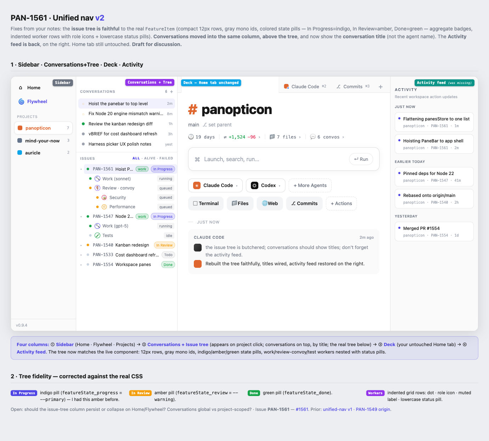

# PAN-1561 — Project-scoped dashboard navigation (PRD)

**Status:** Proposed · **Tracking issue:** [#1561](https://github.com/eltmon/overdeck/issues/1561) · **Evolves:** PAN-1549 (#1549)

> Self-contained design spec. Everything an implementer needs is here plus the repo (`src/dashboard/frontend/src/…`, `CLAUDE.md`) and the mockups in `docs/design/pan-1561-*.html`. No prior-conversation or external context is assumed.

---

## 1. Problem & motivation

The dashboard's navigation has grown into an 18-item left sidebar plus a Command Deck whose layout doesn't match how the user actually works. The user's two most-used surfaces are:

1. **Conversations** — agent chats, which they currently start *globally* (no project context), losing targeted context.
2. **The project → issue tree** in the Command Deck, where they watch agent groups (work / review convoy / test / ship) progress on issues.

There is no first-class notion of "the project I'm working in." The Stage (tabbed work area shipped in PAN-1549) is scoped to a single *issue*, so you can only ever see one issue's panes, and switching means navigating back up the tree.

## 2. Goals / non-goals

**Goals**
- Make the **project** the unit you work in: select a project → a deck of tabs scoped to it.
- Keep the two most-used surfaces central and **project-scoped**: conversations and the issue-tree-with-workers.
- Preserve the launch experience the user loves (omnibox + agent/action pills + timeline) as the deck's **Home tab**, re-scoped to the project.
- Shrink the left rail to **Home · Flywheel · Projects**.
- Surface the **activity feed**.

**Non-goals**
- No new pane types beyond what exists.
- No redesign of the launch UI components themselves (omnibox, pills, timeline) — they are reused.
- No global "flat panebar across all projects" (explicitly rejected — see §9).
- Drag-to-reorder tabs, deep tab-overflow UX — out of scope (note if cheap, else defer).

## 3. Users & primary workflows

Single power user orchestrating many agents across a few projects (panopticon, mind-your-now, auricle). Primary flows: (a) glance at a project's running agents and issue pipeline; (b) open/continue conversations with project context; (c) drive an issue's work/review/test/ship from its tree; (d) spawn terminals/files/web/commits panes as needed.

## 4. Current state (the code as it is today)

Frontend: `src/dashboard/frontend/src/`.

- **App shell** — `App.tsx`. Left `Sidebar` (`components/Sidebar.tsx`, ~18 items) drives `activeTab`; the `command-deck` tab renders `<CommandDeck>` (~line 1174). A global, toggleable activity feed `SessionFeedSidebar` renders when the History toggle is on (~line 1303).
- **CommandDeck** — `components/CommandDeck/index.tsx`. Left sidebar = Conversations list (`ConversationList` → `ConversationRow`) + Projects tree (`ProjectTree/ProjectNode` → `FeatureItem` → `SessionNode`). Content branches (~line 1245): issue selected → `<Stage workspaceId={selectedFeature}>`; conversation → `<ConversationPanel>`; project → `<ProjectOverview>` (per-project pipeline).
- **Stage / deck** — `components/Stage/index.tsx`. **Issue-scoped**: takes a `workspaceId` (issue id), renders a `PaneBar` (`Stage/PaneBar.tsx`) + active pane.
- **HomePane today — NOT the target yet** — `Stage/HomePane/*`. Already has the launch pieces: `Launcher.tsx` (the `Launch, search, run…` omnibox), `AgentDock.tsx` (Claude Code / Codex / + More Agents), `ActionDock.tsx` (Terminal / Files / Web / Commits / + Actions), `Timeline.tsx`, `StatChips.tsx`. **But the header `WorkspaceHeader.tsx` is issue-scoped: icon tile + issue name + `feature/<id>` branch — no `#`, no project/`main`.**
- **Pane state** — `lib/panesStore.ts` (Zustand + localStorage), keyed by an **arbitrary string id** (today the issue id): `panesByWorkspace: Record<id, Pane[]>`, `activePaneByWorkspace`, persisted to `pan-panes:{id}`.
- **Activity feeds (two)** — `components/CommandDeck/ActivityFeedSidebar.tsx` (per-issue, reads `observationsByIssueId`); `components/sessionFeed/SessionFeedSidebar.tsx` (app-global, toggled in `App.tsx`).

## 5. Target design

Four columns. Selecting a project reveals the conversations+tree column and opens its deck.



*Canonical interactive mockup: [`pan-1561-unified-nav-v2.html`](pan-1561-unified-nav-v2.html) (open in a browser).*

```
┌───────────┬───────────────────────┬──────────────────────────┬───────────────┐
│ Sidebar   │ Conversations + Tree  │ Deck (project-scoped)    │ Activity feed │
│ ⌂ Home    │ CONVERSATIONS         │ [⌘1 HOME][PAN-1561][…] + │ ACTIVITY      │
│ 🌀 Flywheel│  • <conv TITLE>   2m  │  # panopticon            │ Just Now      │
│ PROJECTS  │  • <conv TITLE>   8m  │  main · set parent       │  • <status>   │
│ ● panopt. │ ISSUES   All·Alive·…  │  🕐19d ⇄+1.5k 📁7 💬6    │ Earlier Today │
│   myn     │  ▾ PAN-1561 ● [work] │  ┌ Launch, search, run ┐ │  • …          │
│   auricle │     🔨 Work running  │  └────────────── ↵ Run ┘ │ Yesterday     │
│           │     🛡 Review queued │  [Claude][Codex][+More]  │  • …          │
│           │  ▸ PAN-1547 In Prog  │  [Term][Files][Web][…]   │               │
└───────────┴───────────────────────┴──────────────────────────┴───────────────┘
```

## 6. Detailed requirements

### 6.1 Sidebar (column 1)
- Items: `Home`, `Flywheel`, then the **Projects** list (name + open-issue count + status). Nothing else on the rail.
- The ~15 other current nav items (Board, Pipeline, Agents, Resources, Activity, Sessions, Metrics, Costs, Health, Skills, Context, Settings, God View, Awaiting Merge, AutoPreso) are relocated — see open questions.

### 6.2 Conversations + Issue tree (column 2, shown when a project is selected)
- **Conversations on top**, as a plain list (reuse `ConversationRow`), each showing the **conversation title** (`conv.title`), its working spinner / alive dot, relative time, optional cost. **Not** the agent name.
- **Issue tree below** (reuse `ProjectNode`/`FeatureItem`/`SessionNode` verbatim) with the `All · Alive · Failed` filter.
- Both scoped to the selected project.

### 6.3 Deck — project-scoped (column 3)
- A `PaneBar` of tabs for the selected project; **deck keyed by project**.
- `⌘1 HOME` permanent = the **project-scoped Home tab** (see §6.3.1).
- Opening an issue (from the tree), a conversation, or an action (Terminal/Files/Web/Commits) adds a **tab in this project's deck**.
- Switching projects switches decks; tabs persist per project across reloads.

#### 6.3.1 The Home tab is PROJECT-SCOPED (a change, not a verbatim keep)
- **Reuse** the existing launch composition: `Launcher` (omnibox), `AgentDock`, `ActionDock`, `Timeline`, `StatChips`.
- **Change the header** from today's issue style (`WorkspaceHeader`: icon tile + issue name + `feature/<id>`) to the **project style: `# <project>` + `main`** (e.g. `# panopticon`, `main`), as in the mockup.
- **Change the data scope** to the project: project-level stats and **project-scoped conversations** in the timeline (not one issue's).
- The current Home is issue-scoped and **will not match the mockup until this re-scope is done.**

### 6.4 Activity feed (column 4)
- Project-scoped, time-bucketed action-status cards (Just Now / Earlier Today / Yesterday / …), default-on, collapsible.
- Decide: aggregate `ActivityFeedSidebar` across the project's issues, or adapt the global `SessionFeedSidebar`.

## 7. Technical approach (accurate to the code)

- **`panesStore.ts` — do NOT flatten.** It's already generic over a string id; mount the deck with the **project key** instead of the issue id → panes become project-scoped with minimal store change. Keep the per-deck HOME pane. Persisted keys become `pan-panes:{projectKey}`.
- **`Stage` + `HomePane` — re-scope issue → project + change the header.** Reuse `Launcher`/`AgentDock`/`ActionDock`/`Timeline`/`StatChips`; switch `WorkspaceHeader` to the `# <project>` + `main` style; resolve conversations/stats at project scope (today Stage filters conversations by `c.issueId === workspaceId` and resolves a single agentId — both move to project scope).
- **`CommandDeck` selection** — selecting a **project** mounts the project deck (Stage keyed by project) instead of `ProjectOverview`; selecting an **issue** opens an **issue tab inside the project deck** (not a separate issue Stage). Update `handleSelectFeature` / `handleSelectProject`.
- **Relocate** conversations + tree into column 2; **surface** the activity feed as column 4; **trim** the Sidebar.

## 8. Hard constraints (do not violate)

- **Reuse the HomePane launch components; don't reinvent them** — only the header + scope change (§6.3.1).
- **Issue tree stays faithful to the live component** (`FeatureItem`/`SessionNode`/`command-deck.module.css`): compact 12px rows `[caret][status dot][PAN-id gray-mono ≥56px][title][aggregate badges][state pill]`; state-pill colors **In Progress=indigo (`--primary`), In Review=amber (`--warning`), Done=green (`--success`), Todo=gray, Planning=purple**; worker rows = indented grid `dot · role icon (RoleBadge) · muted label · lowercase status pill`, reviewer convoy nested under Review.
- **Conversations show `conv.title`.**
- **An activity feed stays visible.**

## 9. Superseded ideas (in the mockups — IGNORE)

- Global flat PaneBar (`pan-1561-global-panebar.html`, `-grouped.html`) + the `panesStore` flatten — rejected; project-scoped instead.
- "Thread" container (`pan-1561-home-first-threads.html`) — rejected; projects are the container.
- Pipeline-as-Home / persistent boxy conversation column (`pan-1561-project-deck-refined.html`) — rejected.
- `pan-1561-unified-nav.html` (v1), `pan-1561-project-scoped-deck.html` — earlier drafts. **v2 is canonical.**

## 10. Build / run / verify

- **Node 22 only** for the server; **Bun** is the package manager. Runs from bundled `dist` via `pan up`. Never Bun for the server. See `CLAUDE.md` → "Dashboard".
- Build: `npm run build`. Gates (must pass): `npm run typecheck`, `npm run lint`, `npm test`.
- **Browser UAT required** (typecheck ≠ feature-correct).

## 11. Acceptance criteria

- [ ] Sidebar shows only Home · Flywheel · Projects.
- [ ] Clicking a project opens its deck with a **project-scoped Home tab**: header `# <project>` + `main`, project-scoped timeline/stats, launch components intact.
- [ ] Conversations list shows titles; scoped to the project.
- [ ] Issue tree matches today's look (colors, badges, nested workers).
- [ ] Clicking an issue opens a tab in the project deck (doesn't wipe other tabs).
- [ ] Switching projects switches decks; tabs persist per project across reload.
- [ ] Activity feed renders.
- [ ] `typecheck` + `lint` + `test` pass; browser UAT passes.

## 12. Open questions

- Conversations + tree column: filter to the selected project (lean: yes) vs global.
- Issue-tree column: persist vs collapse on Home/Flywheel.
- Where relocated sidebar views land (Home cards vs "More" menu).
- Activity feed: reuse `SessionFeedSidebar` vs project-scoped `ActivityFeedSidebar`.
- Reported "clicking a project defaults to Settings" — not reproduced from routing (default tab is `home`); confirm a repro before treating as a bug.

## 13. File map

- Shell: `App.tsx`, `components/Sidebar.tsx`.
- Command deck: `components/CommandDeck/index.tsx`, `ConversationList.tsx`, `ConversationRow.tsx`, `ProjectTree/{ProjectNode,FeatureItem,SessionNode}.tsx`, `ProjectOverview.tsx`, `RoleBadge.tsx`, `StatusDot.tsx`, `ActivityFeedSidebar.tsx`, `styles/command-deck.module.css`.
- Deck/panes: `components/Stage/*` (`index.tsx`, `PaneBar.tsx`, `HomePane/*`, `panes/*`, `useStageShortcuts.ts`, `types.ts`), `lib/panesStore.ts`.
- Global feed: `components/sessionFeed/SessionFeedSidebar.tsx`.

## Appendix — mockup index (`docs/design/`)

- `pan-1561-unified-nav-v2.html` / `.png` — **canonical**.
- `pan-1561-unified-nav.html`, `pan-1561-project-deck-refined.html`, `pan-1561-project-scoped-deck.html`, `pan-1561-home-first-threads.html`, `pan-1561-global-panebar.html`, `pan-1561-global-panebar-grouped.html` — superseded explorations (see §9).
- `pan-1549-workspace-panes.html` — PAN-1549 origin.
