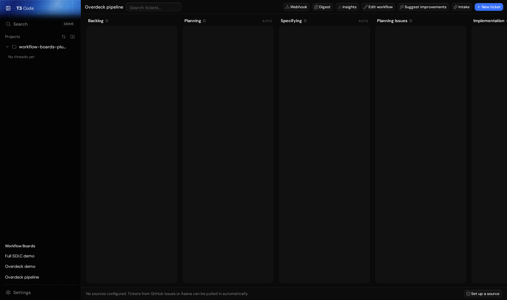
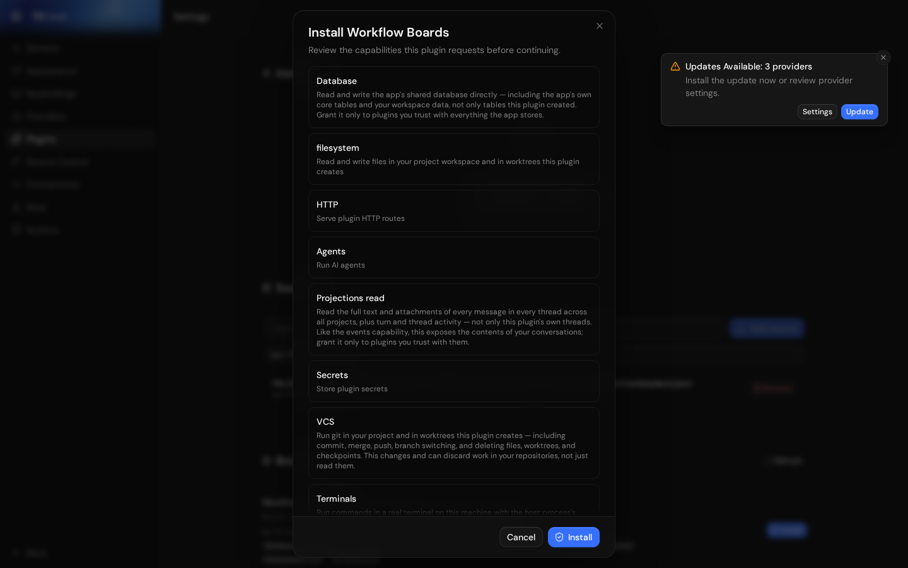
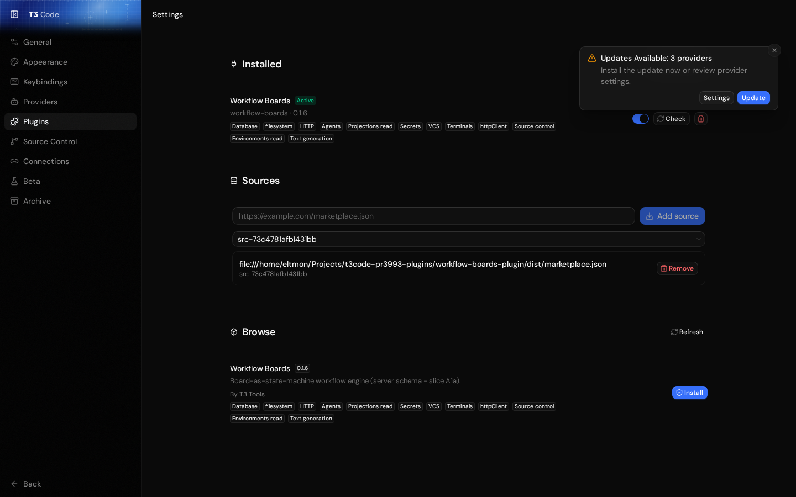
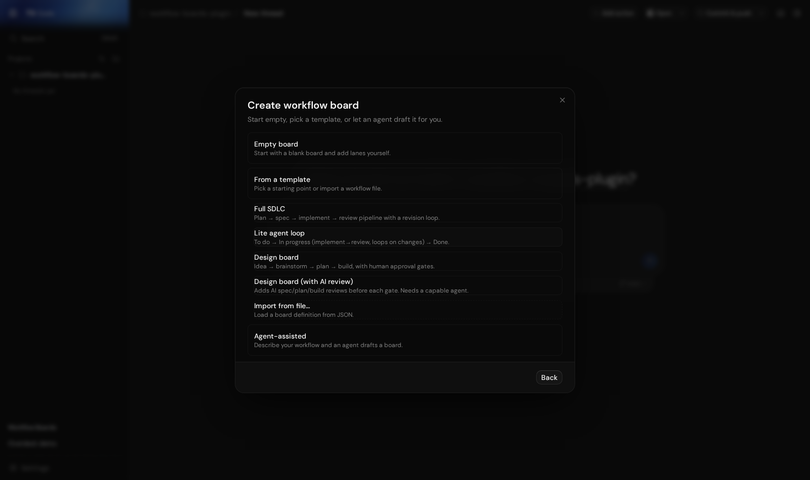
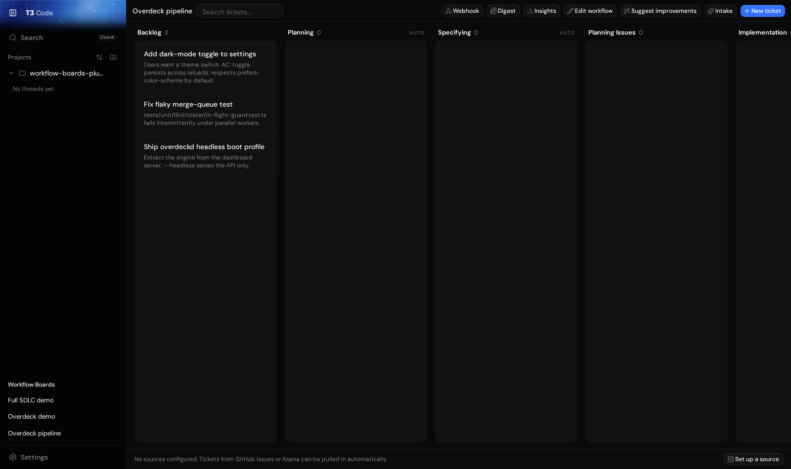
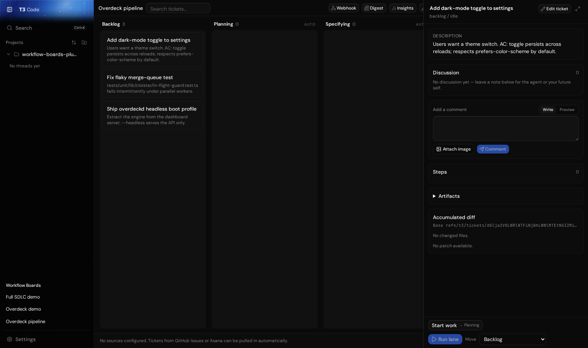
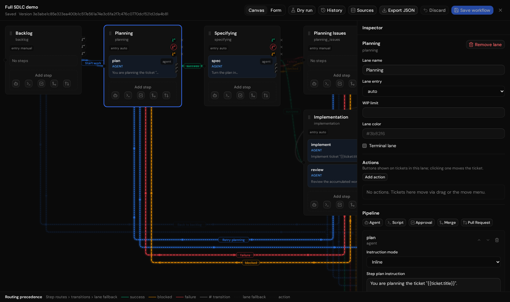
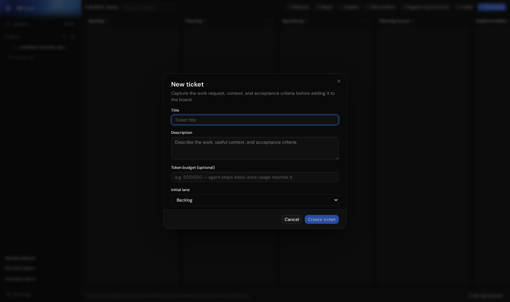

# t3code plugin system in action: ccdwyer's Workflow Boards on PR #3993

**Date:** 2026-08-25
**Related:** [PAN-3776](https://github.com/eltmon/overdeck/issues/3776) (Overdeck-on-t3code, parked),
`t3code-fork-plugin-feasibility.md` (2026-08-19 investigation), PRD `drafts/pan-3776.md` on `overdeck-state`.

This is a live walkthrough of the most complete third-party t3code plugin ever built —
[ccdwyer/workflow-boards-plugin](https://github.com/ccdwyer/workflow-boards-plugin) — running on a
local build of t3code at the head of the (closed) plugin-system PR
[pingdotgg/t3code#3993](https://github.com/pingdotgg/t3code/pull/3993). It exists to answer one
question for PAN-3776: *what does an orchestration-style plugin actually look like inside t3code,
and which host capabilities does it need?*

## Status of t3code plugins (verified 2026-08-25)

- **Shipped t3code has no plugin system.** `main` and every release/nightly have no plugin runtime,
  no package manager, no Plugins settings page. The only "plugins" shipped t3code knows about are
  *Claude Code plugins* (skills/MCP) passed through to the agent.
- **Upstream built one, then closed it.** Maintainer branches (`feat/plugin-runtime-production`,
  `feat/plugin-command-catalog`, `feat/plugin-package-lifecycle`, `feat/plugin-management-ui`, last
  commits 2026-08-23) were consolidated into #8007 → superseded by
  [#8014](https://github.com/pingdotgg/t3code/pull/8014) (+16.5k lines, vouched contributor) →
  closed 2026-08-28: *"We do not want to establish that large trusted-plugin contract through one
  branch."* No open plugin-system PR exists. Those branches expose only `t3.commands@1` and
  `t3.secrets@1`; `views`/`settings` contributions are schema-only.
- **Five community plugin systems were proposed in five months; all closed** — ccdwyer's 8-PR stack
  + #3993 (closed 2026-07-30 because orchestration V2 rewrote the layer it built on: *"not a
  judgement on the change itself"*), yemirhan #6158, zortos293 #7134/#8307, UtkarshUsername #8014.
- **ccdwyer's work is abandoned.** No reply to the #3993 close, no reimplementation on V2, fork 0
  commits ahead, plugin repos untouched since mid-July; the author moved to writing Omarchy shell
  plugins (2026-08-20 onward). Code remains public (MIT) and PR head refs are fetchable
  (`git fetch origin pull/3993/head`), but it cannot be rebased onto current upstream.
- **gmackie's 17 `t3code-*-plugin` repos** (github, linear, sentry, preflight, jujutsu, …) target a
  third, private manifest schema on a personal fork. Reference material only.

Consequence: PAN-3776's un-park triggers are further away than the 2026-08-19 doc assumed, and the
public README wording ("will soon be available as a plugin") is ahead of the facts.

## What ccdwyer's plugin system provides (the seam list Overdeck needs)

From `docs/plugins.md` on the #3993 ref. Capabilities are full-trust grants shown at install:

| Capability | What it grants |
| --- | --- |
| `agents` | create and operate plugin-owned agent threads |
| `terminals` | create and control plugin-owned terminal sessions |
| `vcs` | trusted git operations on repo/worktree paths (commit, merge, push, worktrees) |
| `projections.read` | read thread/turn/message/activity projections across all projects |
| `environments.read` | environment descriptors and projected state |
| `database` | SQL via the shared client; plugin tables namespaced `p_<id>_*`, migrations gated |
| `http` | plugin HTTP routes under `/hooks/plugins/<id>` |
| `secrets`, `httpClient`, `sourceControl`, `textGeneration`, `filesystem` | as named |
| `events` (samples repo) | subscribe to domain events (lossy under backpressure — oldest dropped) |
| `policy` + `context` (samples repo) | deny/defer agent actions; inject rules |

Web SDK (`@t3tools/plugin-sdk-web`): `registerRoute`, `registerSidebarSection`,
`registerSettingsPage`, `registerCommand`, `registerProjectAction`, `registerMessageAction`; host
UI components re-exported from `@t3tools/plugin-sdk-web/ui`; React/effect/SDK are runtime externals
served via an import map so the plugin shares host singletons. Packaging: `manifest.json` +
server/web bundles in a `.tgz`, listed by a `marketplace.json` with sha256; `T3_PLUGIN_DEV=1`
allows `file://` sources.

This is a near-exact specification of the seams PAN-3776 needs (views/routes, sidebar, agents,
terminals, vcs, projections, events, settings) — the design reference for the Ideas post and for
any seams-only fork.

## Walkthrough

### 1. Where it lives



With Settings → Beta → **Sidebar v2 OFF**, the legacy sidebar ends with a **Workflow Boards**
section listing every board; project rows gain a "Create workflow board" action. With Sidebar v2
on (the default UI), neither renders — the plugin predates that sidebar. Direct routes
(`/<environmentId>/p/workflow-boards/boards?boardId=…`) work regardless.

### 2. Install-time capability consent



The host renders each declared capability with a plain-language consequence ("read the full text
of every message in every thread…", "run git… can discard work"). This is the trust model a
pipeline plugin would operate under.

### 3. Settings → Plugins



Installed list with enable toggle and update check; marketplace sources; browse/install.
Uninstall is "pending removal — restart to apply".

### 4. Creating a board



Name → Empty / From a template / Agent-assisted. Templates: **Full SDLC** (plan → spec → implement
→ review with a revision loop), Lite agent loop, Design board (human approval gates), Design board
with AI review, Import from JSON. Final step offers a work source (GitHub Issues / Asana sync).

### 5. The board in action



Full SDLC lanes: Backlog → Planning (AUTO) → Specifying (AUTO) → Planning Issues → Implementation
(AUTO) → Owner Review → Land → Manual Review → Implementation Issues → Done. AUTO lanes run their
agent steps when a ticket enters. Header: Webhook, Digest, Insights, Edit workflow, Suggest
improvements (agent), Intake (braindump → tickets), New ticket.

### 6. Ticket detail



Description, discussion thread ("leave a note for the agent"), steps, artifacts, accumulated diff
against a per-ticket git ref (`refs/t3/tickets/…`), and **Start work → Planning** / Run lane / Move.

### 7. Workflow editor



Lanes are states; each holds a pipeline of steps — **Agent / Script / Approval / Merge / Pull
Request** — with per-step model selection and instruction templates (`{{ticket.title}}`). Routes on
success / failure / blocked, WIP limits, lane entry (manual/auto), dry-run simulation, version
history, JSON export.

### 8. New ticket



Title, description with acceptance criteria, optional **token budget** ("agent steps block once
usage reaches it"), initial lane.

## What this proves — and doesn't

Proven end-to-end: marketplace source → consent → install/upgrade lifecycle → sidebar section,
routed page, project action → templates → editor → tickets. Server side the plugin activated its
daemons (`workflow.github-poller`, `source-syncer`, `webhook.prune`, `terminal-retention`).

Not exercised: no ticket was run through an agent step (needs a configured provider). Observed
defect: board *definitions* did not survive a server restart in this build (sidebar still listed
them; opening gave "Workflow board definition … was not found").

## Reproduction

The ref is not on npm (never merged). Building it:

```sh
cd ~/Projects/t3code && git fetch origin pull/3993/head:refs/remotes/pr/3993
git worktree add --detach ~/Projects/t3code-pr3993 refs/remotes/pr/3993
cd ~/Projects/t3code-pr3993            # needs Node ^24.13, pnpm 11 (corepack)
corepack pnpm install --frozen-lockfile  # ~2.9 GB node_modules
T3_PLUGIN_DEV=1 T3CODE_DEV_INSTANCE=pr3993 corepack pnpm dev   # server :14309, web :6269, prints pairing URL
```

Plugin (needs two local fixes against this ref):

```sh
git clone https://github.com/ccdwyer/workflow-boards-plugin ~/Projects/t3code-pr3993-plugins/workflow-boards-plugin
cd ~/Projects/t3code-pr3993-plugins/workflow-boards-plugin
corepack pnpm install --dangerously-allow-all-builds   # esbuild postinstall must run
T3CODE_ROOT=~/Projects/t3code-pr3993 corepack pnpm link:t3code
# fix 1: scripts/build.mjs — call node_modules/esbuild/bin/esbuild directly (pnpm's shim runs the
#        native binary through node → SyntaxError)
# fix 2: the SDK was split after the plugin was written; move every non-SDK-core import from
#        "@t3tools/plugin-sdk-web" to "@t3tools/plugin-sdk-web/ui" (121 imports, 40 files) and add
#        "@t3tools/plugin-sdk-web/*" to the web bundle externals; bump manifest version
T3CODE_ROOT=~/Projects/t3code-pr3993 node scripts/build.mjs   # -> dist/*.tgz + dist/marketplace.json (file:// URLs)
```

Then in t3code: Settings → Plugins → add `file:///…/dist/marketplace.json` as a source → pick that
source in the Browse dropdown (installing requires a concrete source) → Install → consent. Note the
Plugins page must be reached by in-app navigation; a direct page load races the environment
connection and shows "Plugin management is unavailable before the primary environment is connected".

Screenshots were captured with Playwright at 1440–1600 px wide, dark scheme.
