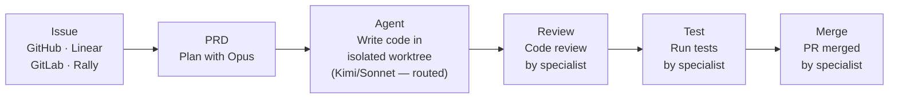

# Panopticon

> *"The Panopticon had six sides, one for each of the Founders of Gallifrey..."*
>
> — Classic Doctor Who. The Panopticon was the great hall at the heart of the Time Lord Citadel, where all could be observed. We liked the metaphor.

```bash
npx @panctl/cli
```

No install step required — `npx @panctl/cli` starts Command Deck and opens the dashboard in your browser. Missing tools are prompted and installed inline the first time you use a feature that needs them.

IDEs were built for humans who type code. Panopticon is built for humans who **direct** code. Command Deck is a live development environment where you spawn agents, watch them work, and stay in control. You see every file change as it lands, review diffs without leaving the conversation, talk to agents to course-correct, hot-swap the model behind them when the task shifts, and branch a conversation to try a different approach without losing the original. When you like where things are headed, the built-in specialist pipeline picks it up — automated code review, tests, and merge — so you never context-switch to a separate CI tab.


## Command Deck

Command Deck is the live development surface where you and your agents work together. Three zones update in real time — no refresh buttons, no polling. Every domain event triggers small, informative UI motion: cost increments animate, tool names fade in and out, status dots pulse, round dividers slide in. You can watch agents work.

| Zone | What You See |
|:-----|:-------------|
| **Issue Header** | Issue identity, pipeline stage, live cost tracking, activity sparkline, quality gate rollup |
| **Agent Context** | Selected agent's role, status, current tool, thinking/waiting state, round history, per-session costs |
| **Conversation + Composer** | Full conversation timeline with composer, or a tabbed dashboard when viewing the issue itself |

### What You Can Do

<CardGroup cols={2}>
  <Card title="Live Diffs as Agents Code" icon="code-compare">
    Every file change appears inline as the agent works. Open the diff panel to review changes turn by turn, or hit "vs main" to see the full picture — no waiting for a PR.
  </Card>
  <Card title="Talk to Your Agents" icon="comments">
    Type in the composer to steer an agent mid-task. Correct its approach, point it at the right file, or tell it to stop and rethink — the same way you'd pair-program with a colleague.
  </Card>
  <Card title="Hot-Swap Models" icon="shuffle">
    Agent struggling? Open the model picker and switch from Sonnet to Opus (or Kimi, GPT, Gemini) without losing the conversation. The right model for each phase of the work.
  </Card>
  <Card title="Branch to Explore" icon="code-branch">
    Fork any conversation to try an alternative approach. Keep the original intact, compare both, merge the one you like. Cheaper than restarting from scratch.
  </Card>
  <Card title="Automatic Checkpoints" icon="camera">
    Command Deck snapshots agent state as work progresses. If an agent goes sideways, roll back to any earlier checkpoint instead of starting over.
  </Card>
  <Card title="Ship Without Switching Tabs" icon="rocket">
    When the code looks right, the specialist pipeline picks it up — automated review, tests, and merge. You click Merge when you're satisfied. No CI dashboard to babysit.
  </Card>
</CardGroup>

## Why Panopticon?

- **You stay in the loop without being in the way.** Watch agents code, review their diffs live, send a message when they drift. You're pair-programming, not babysitting a terminal.
- **The right model for every phase.** Opus plans the architecture, Kimi or Sonnet writes the code, Haiku handles quick commands. Panopticon routes automatically — or you override with two clicks when you know better.
- **Context that outlasts the conversation.** PRDs, plans, checkpoints, beads, and skills carry forward across sessions. Agents pick up where the last one left off, not from a blank slate.
- **One skill format, every tool.** Write a SKILL.md once and it works across Claude Code, Codex, Cursor, and Gemini CLI. 70+ ship out of the box.
- **A pipeline that ships while you move on.** When the implementation looks right, hand it to the specialist pipeline — automated code review, tests, and merge. You click Merge when you're satisfied, or keep working on the next issue.

## How It Works



You can drive any stage from the dashboard, the CLI, or a webhook. Engage as much or as little as you want — from hands-on pair programming with a single agent to launching a fully autonomous pipeline across dozens of issues.

## Key Features

| Feature | Description |
|:--------|:------------|
| **Command Deck** | A live workspace where you watch agents code, review diffs inline, send messages, and manage everything from one surface |
| **Inline Diff Review** | See what changed file-by-file as the agent works, compare any turn against main — no waiting for a PR |
| **Model Hot-Swap** | Switch an agent from Sonnet to Opus to Kimi mid-conversation. Six providers, auto-routing, or manual override |
| **Conversation Forking** | Branch a conversation to try a different approach. Keep the original, compare both, go with what works |
| **Automatic Checkpoints** | Agent state is snapshotted as it progresses — roll back to any earlier point if something goes wrong |
| **Visual Plans** | Work plans render as interactive DAGs with dependencies, acceptance criteria, and live status |
| **Specialist Pipeline** | Five agents handle code review, testing, inspection, UAT, and merge automatically |
| **Cloister** | Lifecycle manager that routes models, detects stuck agents, tracks costs, and orchestrates handoffs |
| **70+ Universal Skills** | Pre-built skills synced via `pan sync` — one SKILL.md works across Claude Code, Codex, Cursor, Gemini CLI |
| **Multi-Tracker Support** | GitHub Issues, Linear, GitLab, Rally — all visible in one unified kanban board |
| **Workspaces** | Isolated git worktrees per issue with optional Docker environments, local or remote |
| **Convoys** | Run parallel agents on related issues with automatic result synthesis |
| **Cost Tracking** | Per-issue, per-stage token costs with model attribution and daily rollups |

## Supported Tools

| Tool | Support |
|:-----|:--------|
| **Claude Code** | Full support — agent runtime, hooks, skills |
| **Codex** | Skills sync and OpenAI subscription login for GPT work agents |
| **Cursor** | Skills sync |
| **Gemini CLI** | Skills sync |
| **Google Antigravity** | Skills sync |

## Dashboard Views

Command Deck at `https://pan.localhost` provides 13 views:

| View | Purpose |
|------|---------|
| **Mission Control** | Project tree + activity timeline — see the full pipeline for any feature |
| **Board** | Kanban board with cost badges, agent status, and workspace controls |
| **Agents** | Cloister Deacon, specialist agents, and issue agents with token/cost tracking |
| **Resources** | System resource monitoring and allocation |
| **Convoys** | Parallel agent runs with synthesis status |
| **Handoffs** | Specialist handoff queue and history |
| **Activity** | Real-time agent command output log |
| **Metrics** | Runtime comparison and performance analytics |
| **Costs** | Per-issue, per-stage cost breakdown with daily totals |
| **Skills** | All available skills with descriptions and sync status |
| **Health** | System health checks and diagnostics |
| **God View** | Aggregate cross-project view of all agent activity |
| **Settings** | Model routing, tracker API keys, and project configuration |


## Quick Start

```bash
npx @panctl/cli
```

`npx @panctl/cli` starts Command Deck immediately. For the packaged desktop app, use `@panctl/desktop`. For headless and CI, use `pan` (install via `npm install -g @panctl/cli`).

Dashboard runs at `https://pan.localhost` (or `http://localhost:3011` if you skip HTTPS setup).

## Learn More

- [Quick Start Guide](/quickstart) - Installation and setup
- [Core Concepts](/concepts) - Understanding Panopticon's architecture
- [CLI Commands](/cli/overview) - All available commands
- [Features](/features/mission-control) - Deep dive into key features
- [Guides](/guides/legacy-codebases) - Step-by-step guides
