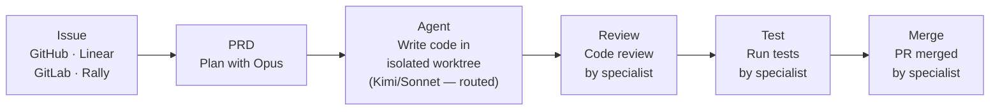

# Panopticon CLI

> *"The Panopticon had six sides, one for each of the Founders of Gallifrey..."*
>
> — Classic Doctor Who. The Panopticon was the great hall at the heart of the Time Lord Citadel, where all could be observed. We liked the metaphor.

```bash
npx @eltmon/panctl
```

No install step required — Command Deck opens immediately. Missing tools are prompted and installed inline the first time you use a feature that needs them.

Panopticon is an open-source control plane for multi-agent software development. It connects to your issue tracker — GitHub Issues, Linear, GitLab, or Rally — and manages the full agent lifecycle from planning through merge.

Assign an issue to Panopticon and an Opus-class model reads the ticket and writes a detailed PRD, then hands off to a cost-effective implementation model (configurable per project — Kimi, Sonnet, GPT, Gemini, or others) that writes code in an isolated git worktree. Once the implementation agent signals completion, five specialist agents take over: an **inspect specialist** verifies each implementation step against the spec, a **review specialist** diffs the changes against the PRD, a **test specialist** runs your CI pipeline, a **UAT specialist** performs browser-based requirement verification, and a **merge specialist** opens the PR. The only human step is clicking **Merge**.

Each stage runs as a separate agent process in its own tmux session with full terminal I/O — attach to any session mid-flight, read its scrollback, or send it commands directly. Coordinating all of this is **Cloister**, a lifecycle manager that routes tasks to models based on capability and cost, monitors agent health, detects and recovers stuck sessions, tracks per-issue token spend, and orchestrates the handoff sequence between specialists. Everything is observable through **Mission Control**, a 13-view real-time dashboard.


## Architecture at a Glance

Panopticon started as a CLI for orchestrating coding agents and grew into **Command Deck**, a desktop app. The CLI, the GUI, and any script that can make an HTTP request all drive the same REST surface — so you can spawn an agent from a kanban card, a terminal, or a webhook without switching tools. Under the hood: an Effect.js + TypeScript server, a React frontend over typed WebSocket RPC, SQLite for state, and Electron as the shell. Launch the app with `npx @eltmon/panctl`; keep `pan` for headless and CI.

## Why Panopticon?

- **Stop babysitting agents.** Spawn them from a dashboard, monitor progress in real time, and let specialists handle code review, testing, and merging.
- **Use the right model for the job.** Opus for planning, Kimi for implementation, Haiku for quick commands — automatic routing based on task type and capabilities.
- **Work survives across sessions.** PRDs, state files, beads, and skills persist context so agents don't start from zero every time.
- **One skill format, every tool.** Write a SKILL.md once and it works across Claude Code, Codex, Cursor, and Gemini CLI.

## How It Works



Plus two specialists that run inline: **Inspect** verifies each implementation step against the spec during development, and **UAT** performs browser-based requirement verification after tests pass.

## Key Features

| Feature | Description |
|:--------|:------------|
| **Multi-Agent Orchestration** | Spawn and manage AI agents in tmux sessions via dashboard or CLI |
| **Cloister Lifecycle Manager** | Automatic model routing, stuck detection, cost tracking, and specialist handoffs |
| **Mission Control** | 13-view dashboard — project tree, activity feed, kanban board, agent status, costs, metrics, and more |
| **PRD-Driven Workflow** | Opus writes a PRD before implementation starts; agents are blocked without one |
| **70+ Universal Skills** | Pre-built skills ship out of the box, synced via `pan sync` — one SKILL.md works across all AI tools |
| **Multi-Tracker Support** | GitHub Issues, Linear, GitLab, Rally — all from one dashboard |
| **Multi-Model Routing** | Anthropic, OpenAI, Google, Kimi, Zhipu — route by task type, capability, and budget |
| **Workspaces** | Git worktree-based feature branches with Docker isolation (local and remote via Fly.io) |
| **Convoys** | Run parallel agents on related issues with automatic synthesis |
| **5 Specialist Agents** | Review, test, inspect, UAT, and merge — fully automated quality pipeline |
| **Beads** | Git-backed task tracking that survives context compaction and works offline |
| **Cost Tracking** | Per-issue, per-stage token costs with dashboard analytics |
| **Legacy Codebase Support** | AI self-monitoring skills that learn your codebase conventions over time |

## Supported Tools

| Tool | Support |
|:-----|:--------|
| **Claude Code** | Full support — agent runtime, hooks, skills |
| **Codex** | Skills sync |
| **Cursor** | Skills sync |
| **Gemini CLI** | Skills sync |
| **Google Antigravity** | Skills sync |

## Dashboard Views

The dashboard at `https://pan.localhost` provides 13 views:

| View | Purpose |
|------|---------|
| **Mission Control** | Project tree + activity timeline — see the full pipeline for any feature |
| **Board** | Kanban board with cost badges, agent status, and workspace controls |
| **Agents** | Cloister Deacon, specialist agents, and issue agents with token/cost tracking |
| **Resources** | System resource monitoring and allocation |
| **Convoys** | Parallel agent runs with synthesis status |
| **Handoffs** | Specialist handoff queue and history |
| **Activity** | Real-time agent command output log |
| **Metrics** | Runtime comparison and performance analytics |
| **Costs** | Per-issue, per-stage cost breakdown with daily totals |
| **Skills** | All available skills with descriptions and sync status |
| **Health** | System health checks and diagnostics |
| **God View** | Aggregate cross-project view of all agent activity |
| **Settings** | Model routing, tracker API keys, and project configuration |


## Quick Start

```bash
npx @eltmon/panctl
```

Command Deck opens immediately. For headless and CI, use `pan` (install via `npm install -g panopticon-cli`).

Dashboard runs at `https://pan.localhost` (or `http://localhost:3011` if you skip HTTPS setup).

## Learn More

- [Quick Start Guide](/quickstart) - Installation and setup
- [Core Concepts](/concepts) - Understanding Panopticon's architecture
- [CLI Commands](/cli/overview) - All available commands
- [Features](/features/mission-control) - Deep dive into key features
- [Guides](/guides/legacy-codebases) - Step-by-step guides
