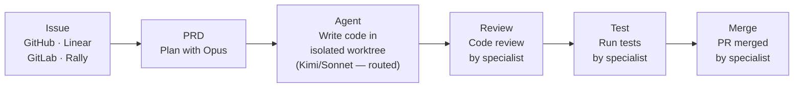

# Panopticon

> *"The Panopticon had six sides, one for each of the Founders of Gallifrey..."*
>
> — Classic Doctor Who. The Panopticon was the great hall at the heart of the Time Lord Citadel, where all could be observed. We liked the metaphor.

```bash
npx @panctl/cli
```

No install step required — `npx @panctl/cli` starts Command Deck and opens the dashboard in your browser. Missing tools are prompted and installed inline the first time you use a feature that needs them.

IDEs were built for humans who type code. Panopticon is built for humans who **direct** code. Command Deck puts you in the cockpit of a multi-model, multi-agent development environment — you see every change as it happens, steer agents mid-flight, swap models on the fly, diff any turn against main, fork conversations when you want to explore a different approach, and checkpoint work so nothing is lost. When you want to go fully hands-off, the specialist pipeline takes your issue from plan to merged PR without you touching the keyboard.


## Command Deck

Command Deck is the live development surface where you and your agents work together. Three zones update in real time — no refresh buttons, no polling. Every domain event triggers small, informative UI motion: cost increments animate, tool names fade in and out, status dots pulse, round dividers slide in. You can watch agents work.

| Zone | What You See |
|:-----|:-------------|
| **Issue Header** | Issue identity, pipeline stage, live cost tracking, activity sparkline, quality gate rollup |
| **Agent Context** | Selected agent's role, status, current tool, thinking/waiting state, round history, per-session costs |
| **Conversation + Composer** | Full conversation timeline with composer, or a tabbed dashboard when viewing the issue itself |

### What You Can Do

<CardGroup cols={2}>
  <Card title="Switch Models" icon="shuffle">
    Change from Opus to Sonnet to Kimi mid-conversation without restarting the agent
  </Card>
  <Card title="Fork Conversations" icon="code-branch">
    Branch into a summary fork or plain fork to explore alternatives without losing the original
  </Card>
  <Card title="Diff Every Turn" icon="code-compare">
    See exactly what changed file-by-file at any point, or compare the full implementation against main
  </Card>
  <Card title="Checkpoint and Restore" icon="camera">
    Auto-captured snapshots of agent state — roll back to any point in the work
  </Card>
  <Card title="Plan Visually" icon="diagram-project">
    vBRIEF plans render as interactive DAGs with item status tracking and acceptance criteria
  </Card>
  <Card title="Go Hands-Off" icon="robot">
    The specialist pipeline takes an issue from plan to merged PR — review, test, inspect, UAT, merge
  </Card>
</CardGroup>

## Why Panopticon?

- **You set the direction, agents do the typing.** See every change in real time, steer with messages, swap models, fork conversations — you're the conductor, not the audience.
- **Use the right model for the job.** Opus for planning, GPT-5.5 or Kimi for implementation, Haiku for quick commands — automatic routing based on task type, capability, and budget. Override any assignment with two clicks.
- **Work survives across sessions.** PRDs, state files, beads, checkpoints, and skills persist context so agents don't start from zero every time.
- **One skill format, every tool.** Write a SKILL.md once and it works across Claude Code, Codex, Cursor, and Gemini CLI.
- **Go fully hands-off when you want to.** The specialist pipeline runs review, test, inspect, UAT, and merge autonomously. You just click Merge when you're satisfied.

## How It Works



You can drive any stage from the dashboard, the CLI, or a webhook. Engage as much or as little as you want — from hands-on pair programming with a single agent to launching a fully autonomous pipeline across dozens of issues.

## Key Features

| Feature | Description |
|:--------|:------------|
| **Command Deck** | Live three-zone development surface with real-time updates, no refresh buttons |
| **Model Switching** | Change models mid-conversation — Opus, Sonnet, GPT, Kimi, Gemini, and more |
| **Conversation Forking** | Branch any conversation to explore alternatives without losing the original |
| **Turn-by-Turn Diffs** | See exactly what changed at every step, compare against main at any point |
| **Checkpoints** | Auto-captured agent state snapshots — roll back to any point in the work |
| **vBRIEF Plan Viewer** | Interactive DAG visualization of work plans with status tracking |
| **Multi-Model Routing** | 6 providers — route by task type, capability, and budget |
| **Cloister Lifecycle Manager** | Automatic routing, stuck detection, cost tracking, specialist handoffs |
| **5 Specialist Agents** | Review, test, inspect, UAT, and merge — fully automated quality pipeline |
| **70+ Universal Skills** | Pre-built skills synced via `pan sync` — one SKILL.md works across all AI tools |
| **Multi-Tracker Support** | GitHub Issues, Linear, GitLab, Rally — unified kanban board |
| **Workspaces** | Git worktree-based feature branches with Docker isolation |
| **Convoys** | Parallel agents on related issues with automatic synthesis |
| **Cost Tracking** | Per-issue, per-stage token costs with dashboard analytics |

## Supported Tools

| Tool | Support |
|:-----|:--------|
| **Claude Code** | Full support — agent runtime, hooks, skills |
| **Codex** | Skills sync and OpenAI subscription login for GPT work agents |
| **Cursor** | Skills sync |
| **Gemini CLI** | Skills sync |
| **Google Antigravity** | Skills sync |

## Dashboard Views

Command Deck at `https://pan.localhost` provides 13 views:

| View | Purpose |
|------|---------|
| **Mission Control** | Project tree + activity timeline — see the full pipeline for any feature |
| **Board** | Kanban board with cost badges, agent status, and workspace controls |
| **Agents** | Cloister Deacon, specialist agents, and issue agents with token/cost tracking |
| **Resources** | System resource monitoring and allocation |
| **Convoys** | Parallel agent runs with synthesis status |
| **Handoffs** | Specialist handoff queue and history |
| **Activity** | Real-time agent command output log |
| **Metrics** | Runtime comparison and performance analytics |
| **Costs** | Per-issue, per-stage cost breakdown with daily totals |
| **Skills** | All available skills with descriptions and sync status |
| **Health** | System health checks and diagnostics |
| **God View** | Aggregate cross-project view of all agent activity |
| **Settings** | Model routing, tracker API keys, and project configuration |


## Quick Start

```bash
npx @panctl/cli
```

`npx @panctl/cli` starts Command Deck immediately. For the packaged desktop app, use `@panctl/desktop`. For headless and CI, use `pan` (install via `npm install -g @panctl/cli`).

Dashboard runs at `https://pan.localhost` (or `http://localhost:3011` if you skip HTTPS setup).

## Learn More

- [Quick Start Guide](/quickstart) - Installation and setup
- [Core Concepts](/concepts) - Understanding Panopticon's architecture
- [CLI Commands](/cli/overview) - All available commands
- [Features](/features/mission-control) - Deep dive into key features
- [Guides](/guides/legacy-codebases) - Step-by-step guides
